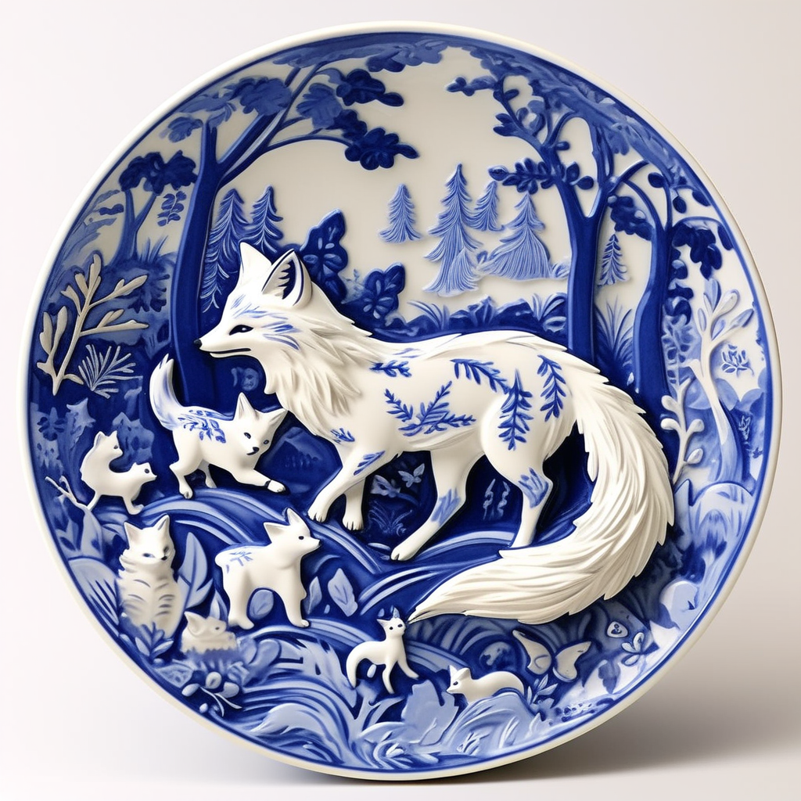
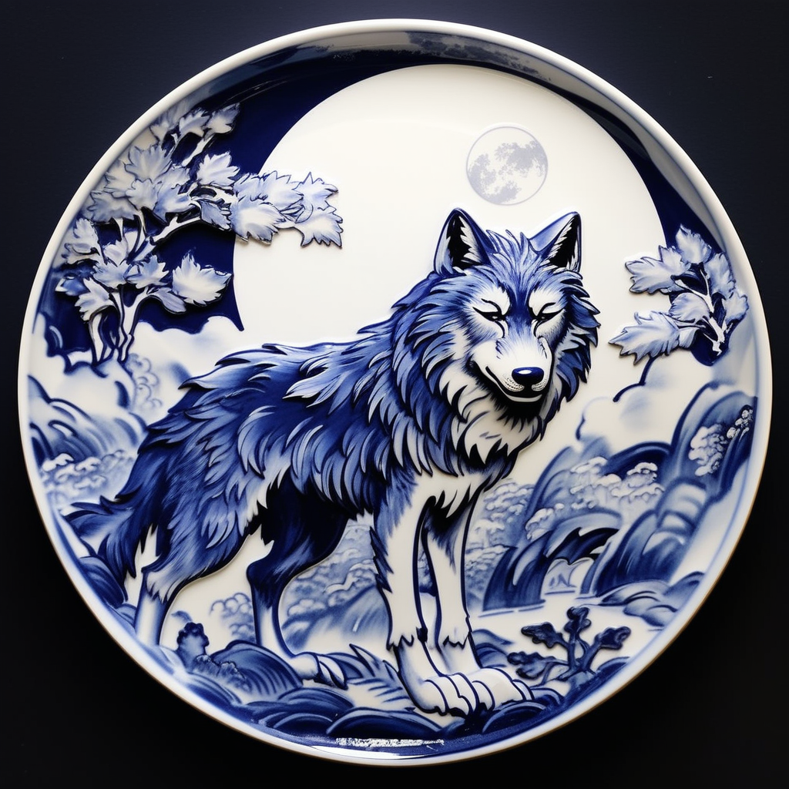
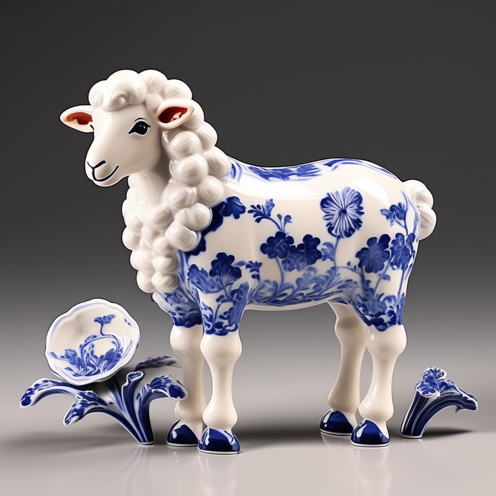
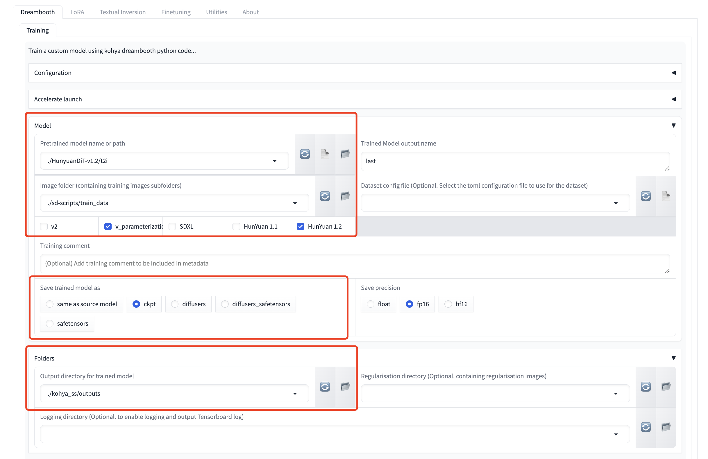
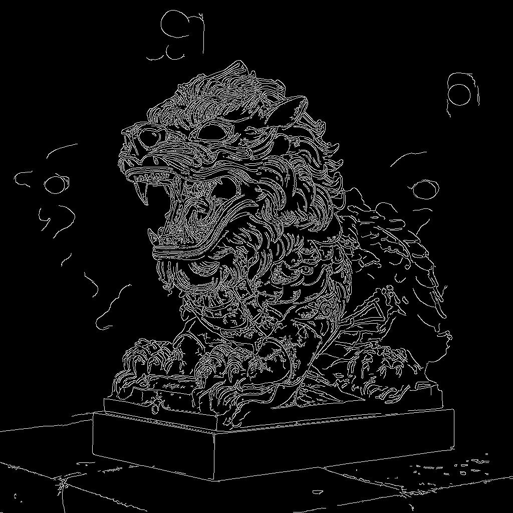
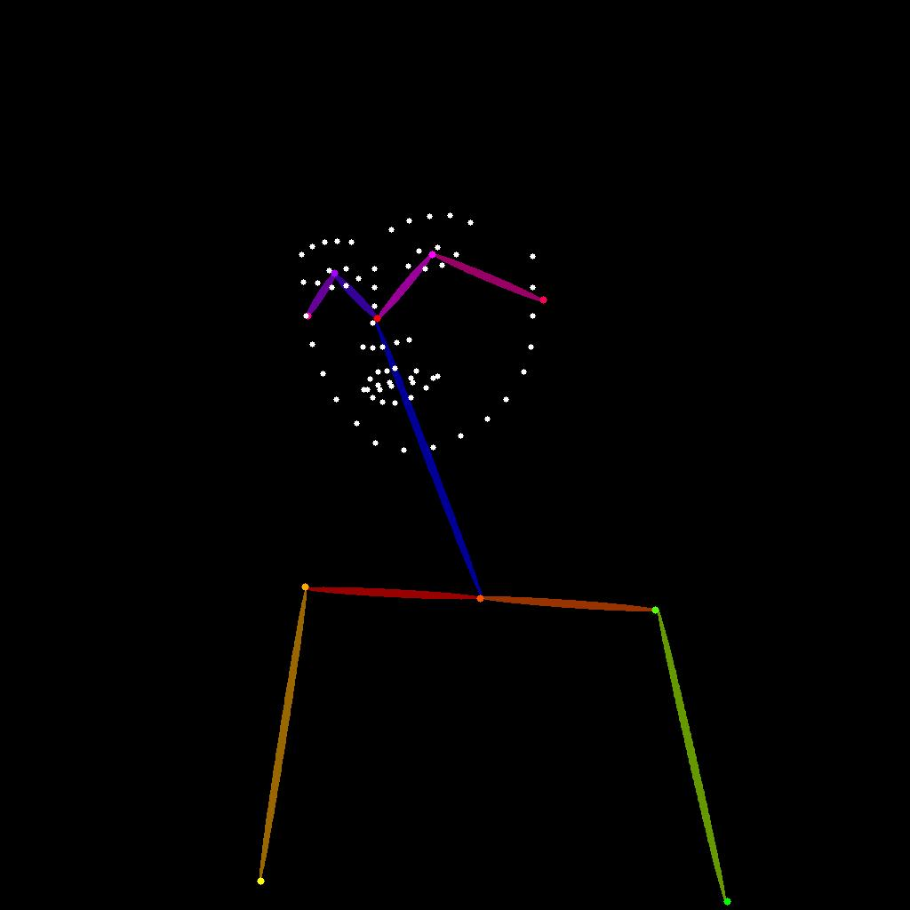
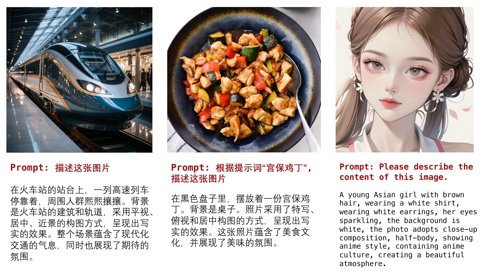

<!-- ## **HunyuanDiT** -->

<p align="center">
  
</p>

# Hunyuan-DiT : A Powerful Multi-Resolution Diffusion Transformer with Fine-Grained Chinese Understanding

<div align="center">
  <a href="https://github.com/Tencent/HunyuanDiT"></a> &ensp;
  <a href="https://dit.hunyuan.tencent.com"></a> &ensp;
  <a href="https://arxiv.org/abs/2405.08748"></a> &ensp;
  <a href="https://arxiv.org/abs/2403.08857"></a> &ensp;
  <a href="https://huggingface.co/Tencent-Hunyuan/HunyuanDiT"></a> &ensp;
  <a href="https://hunyuan.tencent.com/bot/chat"></a> &ensp;
  <a href="https://huggingface.co/spaces/Tencent-Hunyuan/HunyuanDiT"></a> &ensp;
  <a href="./comfyui"></a> &ensp;
</div>

-----

This repo contains PyTorch model definitions, pre-trained weights and inference/sampling code for our paper exploring Hunyuan-DiT. You can find more visualizations on our [project page](https://dit.hunyuan.tencent.com/).

> [**Hunyuan-DiT: A Powerful Multi-Resolution Diffusion Transformer with Fine-Grained Chinese Understanding**](https://arxiv.org/abs/2405.08748) <br>

> [**DialogGen: Multi-modal Interactive Dialogue System for Multi-turn Text-to-Image Generation**](https://arxiv.org/abs/2403.08857) <br>

## 🔥🔥🔥 News!!
* Dec 17, 2024: :tada: Optimize Lora training with `refined grad checkpoint` and `low-bit optimizer`. Just use `--lowbit-opt` to get started.
* Sep 13, 2024: 🎉 IPAdapter is officially supported by HunYuanDiT. Document for it: [./ipadapter](./ipadapter). And scaled attention is utilized to replace flash attention on V100 GPUs.
* Aug 26, 2024, 🎉 HunYuanDIT Controlnet and LoRA are officially supported by ComfyUI. Document for it: [./comfyui](./comfyui)
* Jul 15, 2024: 🚀 HunYuanDiT and Shakker.Ai have jointly launched a fine-tuning event based on the HunYuanDiT 1.2 model. By publishing a lora or fine-tuned model based on HunYuanDiT, you can earn up to $230 bonus from Shakker.Ai. See [Shakker.Ai](https://www.shakker.ai/activitys/shaker-the-world-hunyuan) for more details.
* Jul 15, 2024: :tada: Update ComfyUI to support standardized workflows and compatibility with weights from t2i module and Lora training for versions 1.1/1.2, as well as those trained by Kohya or the official script. 
* Jul 15, 2024: :zap: We offer Docker environments for CUDA 11/12, allowing you to bypass complex installations and play with a single click! See [dockers](#installation-guide-for-linux) for details. 
* Jul 08, 2024: :tada: HYDiT-v1.2 version is released. Please check [HunyuanDiT-v1.2](https://huggingface.co/Tencent-Hunyuan/HunyuanDiT-v1.2) and [Distillation-v1.2](https://huggingface.co/Tencent-Hunyuan/Distillation-v1.2) for more details.
* Jul 03, 2024: :tada: Kohya-hydit version now available for v1.1 and v1.2 models, with GUI for inference. Official Kohya version is under review. See [kohya](./kohya_ss-hydit) for details.
* Jun 27, 2024: :art: Hunyuan-Captioner is released, providing fine-grained caption for training data. See [mllm](./mllm) for details.
* Jun 27, 2024: :tada: Support LoRa and ControlNet in diffusers. See [diffusers](./diffusers) for details.
* Jun 27, 2024: :tada: 6GB GPU VRAM Inference scripts are released. See [lite](./lite) for details.
* Jun 19, 2024: :tada: ControlNet is released, supporting canny, pose and depth control. See [training/inference codes](#controlnet) for details.
* Jun 13, 2024: :zap: HYDiT-v1.1 version is released, which mitigates the issue of image oversaturation and alleviates the watermark issue. Please check [HunyuanDiT-v1.1](https://huggingface.co/Tencent-Hunyuan/HunyuanDiT-v1.1) and 
[Distillation-v1.1](https://huggingface.co/Tencent-Hunyuan/Distillation-v1.1) for more details.
* Jun 13, 2024: :truck: The training code is released, offering [full-parameter training](#full-parameter-training) and [LoRA training](#lora).
* Jun 06, 2024: :tada: Hunyuan-DiT is now available in ComfyUI. Please check [ComfyUI](#using-comfyui) for more details.
* Jun 06, 2024: 🚀 We introduce Distillation version for Hunyuan-DiT acceleration, which achieves **50%** acceleration on NVIDIA GPUs. Please check [Distillation](https://huggingface.co/Tencent-Hunyuan/Distillation) for more details.
* Jun 05, 2024: 🤗 Hunyuan-DiT is now available in 🤗 Diffusers! Please check the [example](#using--diffusers) below.
* Jun 04, 2024: :globe_with_meridians: Support Tencent Cloud links to download the pretrained models! Please check the [links](#-download-pretrained-models) below.
* May 22, 2024: 🚀 We introduce TensorRT version for Hunyuan-DiT acceleration, which achieves **47%** acceleration on NVIDIA GPUs. Please check [TensorRT-libs](https://huggingface.co/Tencent-Hunyuan/TensorRT-libs) for instructions.
* May 22, 2024: 💬 We support demo running multi-turn text2image generation now. Please check the [script](#using-gradio) below.

## 🤖 Try it on the web

Welcome to our web-based [**Tencent Hunyuan Bot**](https://hunyuan.tencent.com/bot/chat), where you can explore our innovative products! Just input the suggested prompts below or any other **imaginative prompts containing drawing-related keywords** to activate the Hunyuan text-to-image generation feature.  Unleash your creativity and create any picture you desire, **all for free!**

You can use simple prompts similar to natural language text

> 画一只穿着西装的猪
>
> draw a pig in a suit
>
> 生成一幅画，赛博朋克风，跑车
> 
> generate a painting, cyberpunk style, sports car

or multi-turn language interactions to create the picture. 

> 画一个木制的鸟
>
> draw a wooden bird
>
> 变成玻璃的
>
> turn into glass


## 🤗 Community Contribution Leaderboard
1. By [@TTPlanetPig](https://github.com/TTPlanetPig)
   - HunyuanDIT_v1.2 ControlNet models
     - Inpaint controlnet: https://huggingface.co/TTPlanet/HunyuanDiT_Controlnet_inpainting
     - Tile controlnet: https://huggingface.co/TTPlanet/HunyuanDiT_Controlnet_tile
     - Lineart controlnet: https://huggingface.co/TTPlanet/HunyuanDiT_Controlnet_lineart
   - HunyuanDIT_v1.2 ComfyUI nodes
     - Comfyui_TTP_CN_Preprocessor: https://github.com/TTPlanetPig/Comfyui_TTP_CN_Preprocessor
     - Comfyui_TTP_Toolset: https://github.com/TTPlanetPig/Comfyui_TTP_Toolset

2. By [@sdbds](https://github.com/sdbds) (bilibili up [青龙圣者](https://space.bilibili.com/219296))
   - Kohya_ss-hydit train tools: https://github.com/zml-ai/HunyuanDIT-PRE/tree/main/kohya_ss-hydit

3. By [@CrazyBoyM](https://github.com/CrazyBoyM) (bilibili up [飞鸟白菜](https://space.bilibili.com/291593914))
   - ComfyUI support for HunyuanDIT_v1.2 Controlnet: https://github.com/comfyanonymous/ComfyUI/pull/4245
    
4. By [@L_A_X](https://huggingface.co/Laxhar/Freeway_Animation_HunYuan_Demo)
   - HunyuanDIT_v1.2 base model for anime
     - Original hf: https://huggingface.co/Laxhar/Freeway_Animation_HunYuan_Demo
     - Converted ComfyUI model: https://huggingface.co/comfyanonymous/Freeway_Animation_Hunyuan_Demo_ComfyUI_Converted
    
## 📑 Open-source Plan

- Hunyuan-DiT (Text-to-Image Model)
  - [x] Inference 
  - [x] Checkpoints 
  - [x] Distillation Version
  - [x] TensorRT Version
  - [x] Training
  - [x] Lora
  - [x] Controlnet (Pose, Canny, Depth)
  - [x] 6GB GPU VRAM Inference 
  - [x] IP-adapter
  - [ ] Hunyuan-DiT-S checkpoints (0.7B model)
- Mllm
  - Hunyuan-Captioner (Re-caption the raw image-text pairs)
    - [x] Inference
  - [Hunyuan-DialogGen](https://github.com/Centaurusalpha/DialogGen) (Prompt Enhancement Model)
    - [x] Inference
- [X] Web Demo (Gradio) 
- [x] Multi-turn T2I Demo (Gradio)
- [X] Cli Demo 
- [X] ComfyUI
- [X] Diffusers
- [X] Kohya
- [ ] WebUI


## Contents
- [Hunyuan-DiT : A Powerful Multi-Resolution Diffusion Transformer with Fine-Grained Chinese Understanding](#hunyuan-dit--a-powerful-multi-resolution-diffusion-transformer-with-fine-grained-chinese-understanding)
  - [🔥🔥🔥 News!!](#-news)
  - [🤖 Try it on the web](#-try-it-on-the-web)
  - [🤗 Community Contribution Leaderboard](#-community-contribution-leaderboard)
  - [📑 Open-source Plan](#-open-source-plan)
  - [Contents](#contents)
  - [Abstract](#abstract)
  - [🎉 Hunyuan-DiT Key Features](#-hunyuan-dit-key-features)
    - [Chinese-English Bilingual DiT Architecture](#chinese-english-bilingual-dit-architecture)
    - [Multi-turn Text2Image Generation](#multi-turn-text2image-generation)
  - [📈 Comparisons](#-comparisons)
  - [🎥 Visualization](#-visualization)
  - [📜 Requirements](#-requirements)
  - [🛠️ Dependencies and Installation](#️-dependencies-and-installation)
    - [Installation Guide for Linux](#installation-guide-for-linux)
  - [🧱 Download Pretrained Models](#-download-pretrained-models)
        - [1. Using HF-Mirror](#1-using-hf-mirror)
        - [2. Resume Download](#2-resume-download)
  - [:truck: Training](#truck-training)
    - [Data Preparation](#data-preparation)
    - [Full-parameter Training](#full-parameter-training)
    - [LoRA](#lora)
  - [🔑 Inference](#-inference)
    - [6GB GPU VRAM Inference](#6gb-gpu-vram-inference)
    - [Using Gradio](#using-gradio)
    - [Using 🤗 Diffusers](#using--diffusers)
    - [Using Command Line](#using-command-line)
    - [More Configurations](#more-configurations)
    - [Using ComfyUI](#using-comfyui)
    - [Using Kohya](#using-kohya)
    - [Using Previous versions](#using-previous-versions)
  - [:building\_construction: Adapter](#building_construction-adapter)
    - [ControlNet](#controlnet)
    - [IP-Adapter](#IP-Adapter)
  - [:art: Hunyuan-Captioner](#art-hunyuan-captioner)
    - [Examples](#examples)
    - [Instructions](#instructions)
    - [Inference](#inference)
    - [Gradio](#gradio)
  - [🚀 Acceleration (for Linux)](#-acceleration-for-linux)
  - [🔗 BibTeX](#-bibtex)
  - [Start History](#start-history)

## **Abstract**

We present Hunyuan-DiT, a text-to-image diffusion transformer with fine-grained understanding of both English and Chinese. To construct Hunyuan-DiT, we carefully designed the transformer structure, text encoder, and positional encoding. We also build from scratch a whole data pipeline to update and evaluate data for iterative model optimization. For fine-grained language understanding, we train a Multimodal Large Language Model to refine the captions of the images. Finally, Hunyuan-DiT can perform multi-round multi-modal dialogue with users, generating and refining images according to the context.
Through our carefully designed holistic human evaluation protocol with more than 50 professional human evaluators, Hunyuan-DiT sets a new state-of-the-art in Chinese-to-image generation compared with other open-source models.


## 🎉 **Hunyuan-DiT Key Features**
### **Chinese-English Bilingual DiT Architecture**
Hunyuan-DiT is a diffusion model in the latent space, as depicted in figure below. Following the Latent Diffusion Model, we use a pre-trained Variational Autoencoder (VAE) to compress the images into low-dimensional latent spaces and train a diffusion model to learn the data distribution with diffusion models. Our diffusion model is parameterized with a transformer. To encode the text prompts, we leverage a combination of pre-trained bilingual (English and Chinese) CLIP and multilingual T5 encoder.
<p align="center">
  
</p>

### Multi-turn Text2Image Generation
Understanding natural language instructions and performing multi-turn interaction with users are important for a
text-to-image system. It can help build a dynamic and iterative creation process that bring the user’s idea into reality
step by step. In this section, we will detail how we empower Hunyuan-DiT with the ability to perform multi-round
conversations and image generation. We train MLLM to understand the multi-round user dialogue
and output the new text prompt for image generation.
<p align="center">
  
</p>

## 📈 Comparisons
In order to comprehensively compare the generation capabilities of HunyuanDiT and other models, we constructed a 4-dimensional test set, including Text-Image Consistency, Excluding AI Artifacts, Subject Clarity, Aesthetic. More than 50 professional evaluators performs the evaluation.

<p align="center">
<table> 
<thead> 
<tr> 
    <th rowspan="2">Model</th> <th rowspan="2">Open Source</th> <th>Text-Image Consistency (%)</th> <th>Excluding AI Artifacts (%)</th> <th>Subject Clarity (%)</th> <th rowspan="2">Aesthetics (%)</th> <th rowspan="2">Overall (%)</th> 
</tr> 
</thead> 
<tbody> 
<tr> 
    <td>SDXL</td> <td> ✔ </td> <td>64.3</td> <td>60.6</td> <td>91.1</td> <td>76.3</td> <td>42.7</td> 
</tr> 
<tr> 
    <td>PixArt-α</td> <td> ✔</td> <td>68.3</td> <td>60.9</td> <td>93.2</td> <td>77.5</td> <td>45.5</td> 
</tr> 
<tr> 
    <td>Playground 2.5</td> <td>✔</td> <td>71.9</td> <td>70.8</td> <td>94.9</td> <td>83.3</td> <td>54.3</td> 
</tr> 

<tr> 
    <td>SD 3</td> <td>&#10008</td> <td>77.1</td> <td>69.3</td> <td>94.6</td> <td>82.5</td> <td>56.7</td> 
    
</tr> 
<tr> 
    <td>MidJourney v6</td><td>&#10008</td> <td>73.5</td> <td>80.2</td> <td>93.5</td> <td>87.2</td> <td>63.3</td> 
</tr> 
<tr> 
    <td>DALL-E 3</td><td>&#10008</td> <td>83.9</td> <td>80.3</td> <td>96.5</td> <td>89.4</td> <td>71.0</td> 
</tr> 
<tr style="font-weight: bold; background-color: #f2f2f2;"> 
    <td>Hunyuan-DiT</td><td>✔</td> <td>74.2</td> <td>74.3</td> <td>95.4</td> <td>86.6</td> <td>59.0</td> 
</tr>
</tbody>
</table>
</p>

## 🎥 Visualization

* **Chinese Elements**
<p align="center">
  
</p>

* **Long Text Input**


<p align="center">
  
</p>

* **Multi-turn Text2Image Generation**

https://github.com/Tencent/tencent.github.io/assets/27557933/94b4dcc3-104d-44e1-8bb2-dc55108763d1


---

## 📜 Requirements

This repo consists of DialogGen (a prompt enhancement model) and Hunyuan-DiT (a text-to-image model).

The following table shows the requirements for running the models (batch size = 1):

|          Model          | --load-4bit (DialogGen) | GPU Peak Memory |       GPU       |
|:-----------------------:|:-----------------------:|:---------------:|:---------------:|
| DialogGen + Hunyuan-DiT |            ✘            |       32G       |      A100       |
| DialogGen + Hunyuan-DiT |            ✔            |       22G       |      A100       |
|       Hunyuan-DiT       |            -            |       11G       |      A100       |
|       Hunyuan-DiT       |            -            |       14G       | RTX3090/RTX4090 |

* An NVIDIA GPU with CUDA support is required. 
  * We have tested V100 and A100 GPUs.
  * **Minimum**: The minimum GPU memory required is 11GB.
  * **Recommended**: We recommend using a GPU with 32GB of memory for better generation quality.
* Tested operating system: Linux

## 🛠️ Dependencies and Installation

Begin by cloning the repository:
```shell
git clone https://github.com/tencent/HunyuanDiT
cd HunyuanDiT
```

### Installation Guide for Linux

We provide an `environment.yml` file for setting up a Conda environment.
Conda's installation instructions are available [here](https://docs.anaconda.com/free/miniconda/index.html).

We recommend CUDA versions 11.7 and 12.0+.

```shell
# 1. Prepare conda environment
conda env create -f environment.yml

# 2. Activate the environment
conda activate HunyuanDiT

# 3. Install pip dependencies
python -m pip install -r requirements.txt

# 4. Install flash attention v2 for acceleration (requires CUDA 11.6 or above)
python -m pip install git+https://github.com/Dao-AILab/flash-attention.git@v2.1.2.post3
```

Additionally, you can also use docker to set up the environment.
```shell
# 1. Use the following link to download the docker image tar file.
# For CUDA 12
wget https://dit.hunyuan.tencent.com/download/HunyuanDiT/hunyuan_dit_cu12.tar
# For CUDA 11
wget https://dit.hunyuan.tencent.com/download/HunyuanDiT/hunyuan_dit_cu11.tar

# 2. Import the docker tar file and show the image meta information
# For CUDA 12
docker load -i hunyuan_dit_cu12.tar
# For CUDA 11
docker load -i hunyuan_dit_cu11.tar  

docker image ls

# 3. Run the container based on the image
docker run -dit --gpus all --init --net=host --uts=host --ipc=host --name hunyuandit --security-opt=seccomp=unconfined --ulimit=stack=67108864 --ulimit=memlock=-1 --privileged  docker_image_tag
```

### Installation Guide for windows
build Windows environments with python=3.10 and torch=2.1.2 cuda=12.1 for mathing comfyUI
```shell
# 1. Prepare conda environment
conda  create -n HunyuanDiT python==3.10.11

# 2. Activate the environment
conda activate HunyuanDiT

# 3. Install pytorch
pip install torch==2.1.2 torchvision==0.16.2 torchaudio==2.1.2 --index-url https://download.pytorch.org/whl/cu121

# 4. Install deepspeed diffusers and nvidia-pyindex
pip install deepspeed-0.6.3-py3-none-any.whl
pip install diffusers-0.21.2-py3-none-any.whl
pip install nvidia_pyindex-1.0.9-py3-none-any.whl

# 5. Install pip dependencies
pip install -r requirements.txt

# 6. Install flash attention v2 for acceleration (requires CUDA 11.6 or above)
pip install git+https://github.com/Dao-AILab/flash-attention.git@v2.1.2.post3
```

## 🧱 Download Pretrained Models
To download the model, first install the huggingface-cli. (Detailed instructions are available [here](https://huggingface.co/docs/huggingface_hub/guides/cli).)

```shell
python -m pip install "huggingface_hub[cli]"
```

Then download the model using the following commands:

```shell
# Create a directory named 'ckpts' where the model will be saved, fulfilling the prerequisites for running the demo.
mkdir ckpts
# Use the huggingface-cli tool to download the model.
# The download time may vary from 10 minutes to 1 hour depending on network conditions.
huggingface-cli download Tencent-Hunyuan/HunyuanDiT-v1.2 --local-dir ./ckpts
```

<details>
<summary>💡Tips for using huggingface-cli (network problem)</summary>

##### 1. Using HF-Mirror

If you encounter slow download speeds in China, you can try a mirror to speed up the download process. For example,

```shell
HF_ENDPOINT=https://hf-mirror.com huggingface-cli download Tencent-Hunyuan/HunyuanDiT-v1.2 --local-dir ./ckpts
```

##### 2. Resume Download

`huggingface-cli` supports resuming downloads. If the download is interrupted, you can just rerun the download 
command to resume the download process.

Note: If an `No such file or directory: 'ckpts/.huggingface/.gitignore.lock'` like error occurs during the download 
process, you can ignore the error and rerun the download command.

</details>

---

All models will be automatically downloaded. For more information about the model, visit the Hugging Face repository [here](https://huggingface.co/Tencent-Hunyuan/HunyuanDiT).

|       Model       | #Params |                                        Huggingface Download URL                                        |                                   Tencent Cloud Download URL                                   |
|:-----------------:|:-------:|:------------------------------------------------------------------------------------------------------:|:----------------------------------------------------------------------------------------------:|
|        mT5        |  1.6B   |               [mT5](https://huggingface.co/Tencent-Hunyuan/HunyuanDiT/tree/main/t2i/mt5)               |               [mT5](https://dit.hunyuan.tencent.com/download/HunyuanDiT/mt5.zip)               |
|       CLIP        |  350M   |       [CLIP](https://huggingface.co/Tencent-Hunyuan/HunyuanDiT/tree/main/t2i/clip_text_encoder)        |       [CLIP](https://dit.hunyuan.tencent.com/download/HunyuanDiT/clip_text_encoder.zip)        |
|     Tokenizer     |  -      |         [Tokenizer](https://huggingface.co/Tencent-Hunyuan/HunyuanDiT/tree/main/t2i/tokenizer)         |         [Tokenizer](https://dit.hunyuan.tencent.com/download/HunyuanDiT/tokenizer.zip)         |
|     DialogGen     |  7.0B   |           [DialogGen](https://huggingface.co/Tencent-Hunyuan/HunyuanDiT/tree/main/dialoggen)           |         [DialogGen](https://dit.hunyuan.tencent.com/download/HunyuanDiT/dialoggen.zip)         |
| sdxl-vae-fp16-fix |   83M   | [sdxl-vae-fp16-fix](https://huggingface.co/Tencent-Hunyuan/HunyuanDiT/tree/main/t2i/sdxl-vae-fp16-fix) | [sdxl-vae-fp16-fix](https://dit.hunyuan.tencent.com/download/HunyuanDiT/sdxl-vae-fp16-fix.zip) |
| Hunyuan-DiT-v1.0  |  1.5B   |          [Hunyuan-DiT](https://huggingface.co/Tencent-Hunyuan/HunyuanDiT/tree/main/t2i/model)          |       [Hunyuan-DiT-v1.0](https://dit.hunyuan.tencent.com/download/HunyuanDiT/model.zip)        |
| Hunyuan-DiT-v1.1  |  1.5B   |     [Hunyuan-DiT-v1.1](https://huggingface.co/Tencent-Hunyuan/HunyuanDiT-v1.1/tree/main/t2i/model)     |     [Hunyuan-DiT-v1.1](https://dit.hunyuan.tencent.com/download/HunyuanDiT/model-v1_1.zip)     |
| Hunyuan-DiT-v1.2  |  1.5B   |     [Hunyuan-DiT-v1.2](https://huggingface.co/Tencent-Hunyuan/HunyuanDiT-v1.2/tree/main/t2i/model)     |     [Hunyuan-DiT-v1.2](https://dit.hunyuan.tencent.com/download/HunyuanDiT/model-v1_2.zip)     |
|     Data demo     |  -      |                                                   -                                                    |         [Data demo](https://dit.hunyuan.tencent.com/download/HunyuanDiT/data_demo.zip)         |

## :truck: Training

### Data Preparation

  Refer to the commands below to prepare the training data. 
  
  1. Install dependencies
  
      We offer an efficient data management library, named IndexKits, supporting the management of reading hundreds of millions of data during training, see more in [docs](./IndexKits/README.md).
      ```shell
      # 1 Install dependencies
      cd HunyuanDiT
      pip install -e ./IndexKits
     ```
  2. Data download 
  
     Feel free to download the [data demo](https://dit.hunyuan.tencent.com/download/HunyuanDiT/data_demo.zip).
     ```shell
     # 2 Data download
     wget -O ./dataset/data_demo.zip https://dit.hunyuan.tencent.com/download/HunyuanDiT/data_demo.zip
     unzip ./dataset/data_demo.zip -d ./dataset
     mkdir ./dataset/porcelain/arrows ./dataset/porcelain/jsons
     ```
  3. Data conversion 
  
     Create a CSV file for training data with the fields listed in the table below.
    
     |    Fields       | Required  |  Description     |   Example   |
     |:---------------:| :------:  |:----------------:|:-----------:|
     |   `image_path`  | Required  |  image path               |     `./dataset/porcelain/images/0.png`        | 
     |   `text_zh`     | Required  |    text               |  青花瓷风格，一只蓝色的鸟儿站在蓝色的花瓶上，周围点缀着白色花朵，背景是白色 | 
     |   `md5`         | Optional  |    image md5 (Message Digest Algorithm 5)  |    `d41d8cd98f00b204e9800998ecf8427e`         | 
     |   `width`       | Optional  |    image width    |     `1024 `       | 
     |   `height`      | Optional  |    image height   |    ` 1024 `       | 
     
     > ⚠️ Optional fields like MD5, width, and height can be omitted. If omitted, the script below will automatically calculate them. This process can be time-consuming when dealing with large-scale training data.
  
     We utilize [Arrow](https://github.com/apache/arrow) for training data format, offering a standard and efficient in-memory data representation. A conversion script is provided to transform CSV files into Arrow format.
     ```shell  
     # 3 Data conversion 
     python ./hydit/data_loader/csv2arrow.py ./dataset/porcelain/csvfile/image_text.csv ./dataset/porcelain/arrows 1
     ```
  
  4. Data Selection and Configuration File Creation 
     
      We configure the training data through YAML files. In these files, you can set up standard data processing strategies for filtering, copying, deduplicating, and more regarding the training data. For more details, see [./IndexKits](IndexKits/docs/MakeDataset.md).
  
      For a sample file, please refer to [file](./dataset/yamls/porcelain.yaml). For a full parameter configuration file, see [file](./IndexKits/docs/MakeDataset.md).
  
     
  5. Create training data index file using YAML file.
    
     ```shell
      # Single Resolution Data Preparation
      idk base -c dataset/yamls/porcelain.yaml -t dataset/porcelain/jsons/porcelain.json
   
      # Multi Resolution Data Preparation     
      idk multireso -c dataset/yamls/porcelain_mt.yaml -t dataset/porcelain/jsons/porcelain_mt.json
      ```
   
  The directory structure for `porcelain` dataset is:

  ```shell
   cd ./dataset
  
   porcelain
      ├──images/  (image files)
      │  ├──0.png
      │  ├──1.png
      │  ├──......
      ├──csvfile/  (csv files containing text-image pairs)
      │  ├──image_text.csv
      ├──arrows/  (arrow files containing all necessary training data)
      │  ├──00000.arrow
      │  ├──00001.arrow
      │  ├──......
      ├──jsons/  (final training data index files which read data from arrow files during training)
      │  ├──porcelain.json
      │  ├──porcelain_mt.json
   ```

### Full-parameter Training
  
  **Requirement:** 
  1. The minimum requriment is a single GPU with at least 20GB memory, but we recommend to use a GPU with about 30 GB memory to avoid host memory offloading. 
  2. Additionally, we encourage users to leverage the multiple GPUs across different nodes to speed up training on large datasets. 
  
  **Notice:**
  1. Personal users can also use the light-weight Kohya to finetune the model with about 16 GB memory. Currently, we are trying to further reduce the memory usage of our industry-level framework for personal users. 
  2. If you have enough GPU memory, please try to remove  `--cpu-offloading` or `--gradient-checkpointing` for less time costs.

  Specifically for distributed training, you have the flexibility to control **single-node** / **multi-node** training by adjusting parameters such as `--hostfile` and `--master_addr`. For more details, see [link](https://www.deepspeed.ai/getting-started/#resource-configuration-multi-node).

  ```shell
  # Single Resolution Training
  PYTHONPATH=./ sh hydit/train.sh --index-file dataset/porcelain/jsons/porcelain.json
  
  # Multi Resolution Training
  PYTHONPATH=./ sh hydit/train.sh --index-file dataset/porcelain/jsons/porcelain_mt.json --multireso --reso-step 64
  
  # Training with old version of HunyuanDiT (<= v1.1)
  PYTHONPATH=./ sh hydit/train_v1.1.sh --index-file dataset/porcelain/jsons/porcelain.json
  ```

  After checkpoints are saved, you can use the following command to evaluate the model.
  ```shell
  # Inference
    #   You should replace the 'log_EXP/xxx/checkpoints/final.pt' with your actual path.
  python sample_t2i.py --infer-mode fa --prompt "青花瓷风格，一只可爱的哈士奇" --no-enhance --dit-weight log_EXP/xxx/checkpoints/final.pt --load-key module
  
  # Old version of HunyuanDiT (<= v1.1)
  #   You should replace the 'log_EXP/xxx/checkpoints/final.pt' with your actual path.
  python sample_t2i.py --infer-mode fa --prompt "青花瓷风格，一只可爱的哈士奇" --model-root ./HunyuanDiT-v1.1 --use-style-cond --size-cond 1024 1024 --beta-end 0.03 --no-enhance --dit-weight log_EXP/xxx/checkpoints/final.pt --load-key module
  ```

### LoRA


We provide training and inference scripts for LoRA, detailed in the [./lora](./lora/README.md). 

  ```shell
  # Training for porcelain LoRA.
  PYTHONPATH=./ sh lora/train_lora_with_fa.sh --index-file dataset/porcelain/jsons/porcelain.json
  
  # Inference using trained LORA weights.
  python sample_t2i.py --infer-mode fa --prompt "青花瓷风格，一只小狗"  --no-enhance --lora-ckpt log_EXP/001-lora_porcelain_ema_rank64/checkpoints/0001000.pt
  ```
 If you can't install flash_attn, use code:
  ```shell
  # Training for porcelain LoRA.
  PYTHONPATH=./ sh lora/train_lora.sh --index-file dataset/porcelain/jsons/porcelain.json
  
  # Inference using trained LORA weights.
  python sample_t2i.py --infer-mode torch --prompt "青花瓷风格，一只小狗"  --no-enhance --lora-ckpt log_EXP/001-lora_porcelain_ema_rank64/checkpoints/0001000.pt
  ```
 We offer two types of trained LoRA weights for `porcelain` and `jade`, see details at [links](https://huggingface.co/Tencent-Hunyuan/HYDiT-LoRA)
  ```shell
  cd HunyuanDiT
  # Use the huggingface-cli tool to download the model.
  huggingface-cli download Tencent-Hunyuan/HYDiT-LoRA --local-dir ./ckpts/t2i/lora
  
  # Quick start
  python sample_t2i.py --infer-mode fa --prompt "青花瓷风格，一只猫在追蝴蝶"  --no-enhance --load-key ema --lora-ckpt ./ckpts/t2i/lora/porcelain
  ```
 <table>
  <tr>
    <td colspan="4" align="center">Examples of training data</td>
  </tr>
  
  <tr>
    <td align="center"></td>
    <td align="center"></td>
    <td align="center"></td>
    <td align="center"></td>
  </tr>
  <tr>
    <td align="center">青花瓷风格，一只蓝色的鸟儿站在蓝色的花瓶上，周围点缀着白色花朵，背景是白色 （Porcelain style, a blue bird stands on a blue vase, surrounded by white flowers, with a white background.
）</td>
    <td align="center">青花瓷风格，这是一幅蓝白相间的陶瓷盘子，上面描绘着一只狐狸和它的幼崽在森林中漫步，背景是白色 （Porcelain style, this is a blue and white ceramic plate depicting a fox and its cubs strolling in the forest, with a white background.）</td>
    <td align="center">青花瓷风格，在黑色背景上，一只蓝色的狼站在蓝白相间的盘子上，周围是树木和月亮 （Porcelain style, on a black background, a blue wolf stands on a blue and white plate, surrounded by trees and the moon.）</td>
    <td align="center">青花瓷风格，在蓝色背景上，一只蓝色蝴蝶和白色花朵被放置在中央 （Porcelain style, on a blue background, a blue butterfly and white flowers are placed in the center.）</td>
  </tr>
  <tr>
    <td colspan="4" align="center">Examples of inference results</td>
  </tr>
  <tr>
    <td align="center"></td>
    <td align="center"></td>
    <td align="center"></td>
    <td align="center"></td>
  </tr>
  <tr>
    <td align="center">青花瓷风格，苏州园林 （Porcelain style,  Suzhou Gardens.）</td>
    <td align="center">青花瓷风格，一朵荷花 （Porcelain style,  a lotus flower.）</td>
    <td align="center">青花瓷风格，一只羊（Porcelain style, a sheep.）</td>
    <td align="center">青花瓷风格，一个女孩在雨中跳舞（Porcelain style, a girl dancing in the rain.）</td>
  </tr>
  
</table>


## 🔑 Inference

### 6GB GPU VRAM Inference
Running HunyuanDiT in under 6GB GPU VRAM is available now based on [diffusers](https://huggingface.co/docs/diffusers/main/en/api/pipelines/hunyuandit). Here we provide instructions and demo for your quick start.

> The 6GB version supports Nvidia Ampere architecture series graphics cards such as RTX 3070/3080/4080/4090, A100, and so on.

The only thing you need do is to install the following library:

```bash
pip install -U bitsandbytes
pip install git+https://github.com/huggingface/diffusers
pip install torch==2.0.0
```

Then you can enjoy your HunyuanDiT text-to-image journey under 6GB GPU VRAM directly!

Here is a demo for you.

```bash
cd HunyuanDiT

# Quick start
model_id=Tencent-Hunyuan/HunyuanDiT-v1.2-Diffusers-Distilled
prompt=一个宇航员在骑马
infer_steps=50
guidance_scale=6
python3 lite/inference.py ${model_id} ${prompt} ${infer_steps} ${guidance_scale}
```

More details can be found in [./lite](lite/README.md).


### Using Gradio

Make sure the conda environment is activated before running the following command.

```shell
# By default, we start a Chinese UI. Using Flash Attention for acceleration.
python app/hydit_app.py --infer-mode fa

# Using special port and host
python app/hydit_app.py --infer-mode fa --server_name 0.0.0.0 --server_port 443 --load-key distill

# You can disable the enhancement model if the GPU memory is insufficient.
# The enhancement will be unavailable until you restart the app without the `--no-enhance` flag. 
python app/hydit_app.py --no-enhance --infer-mode fa

# Start with English UI
python app/hydit_app.py --lang en --infer-mode fa

# Start a multi-turn T2I generation UI. 
# If your GPU memory is less than 32GB, use '--load-4bit' to enable 4-bit quantization, which requires at least 22GB of memory.
python app/multiTurnT2I_app.py --infer-mode fa
```
Then the demo can be accessed through http://0.0.0.0:443. It should be noted that the 0.0.0.0 here needs to be X.X.X.X with your server IP.

### Using 🤗 Diffusers

Please install PyTorch version 2.0 or higher in advance to satisfy the requirements of the specified version of the diffusers library.  

Install 🤗 diffusers, ensuring that the version is at least 0.28.1:

```shell
pip install git+https://github.com/huggingface/diffusers.git
```
or
```shell
pip install diffusers
```

You can generate images with both Chinese and English prompts using the following Python script:
```py
import torch
from diffusers import HunyuanDiTPipeline

pipe = HunyuanDiTPipeline.from_pretrained("Tencent-Hunyuan/HunyuanDiT-v1.2-Diffusers", torch_dtype=torch.float16)
pipe.to("cuda")

# You may also use English prompt as HunyuanDiT supports both English and Chinese
# prompt = "An astronaut riding a horse"
prompt = "一个宇航员在骑马"
image = pipe(prompt).images[0]
```
You can use our distilled model to generate images even faster:

```py
import torch
from diffusers import HunyuanDiTPipeline

pipe = HunyuanDiTPipeline.from_pretrained("Tencent-Hunyuan/HunyuanDiT-v1.2-Diffusers-Distilled", torch_dtype=torch.float16)
pipe.to("cuda")

# You may also use English prompt as HunyuanDiT supports both English and Chinese
# prompt = "An astronaut riding a horse"
prompt = "一个宇航员在骑马"
image = pipe(prompt, num_inference_steps=25).images[0]
```
More details can be found in [HunyuanDiT-v1.2-Diffusers-Distilled](https://huggingface.co/Tencent-Hunyuan/HunyuanDiT-v1.2-Diffusers-Distilled)

**More functions:** For other functions like LoRA and ControlNet, please have a look at the README of [./diffusers](diffusers).

### Using Command Line

We provide several commands to quick start: 

```shell
# Only Text-to-Image. Flash Attention mode
python sample_t2i.py --infer-mode fa --prompt "渔舟唱晚" --no-enhance

# Generate an image with other image sizes.
python sample_t2i.py --infer-mode fa --prompt "渔舟唱晚" --image-size 1280 768

# Prompt Enhancement + Text-to-Image. DialogGen loads with 4-bit quantization, but it may loss performance.
python sample_t2i.py --infer-mode fa --prompt "渔舟唱晚"  --load-4bit

```

More example prompts can be found in [example_prompts.txt](example_prompts.txt)

### More Configurations

We list some more useful configurations for easy usage:

|    Argument     |  Default  |                     Description                     |
|:---------------:|:---------:|:---------------------------------------------------:|
|   `--prompt`    |   None    |        The text prompt for image generation         |
| `--image-size`  | 1024 1024 |           The size of the generated image           |
|    `--seed`     |    42     |        The random seed for generating images        |
| `--infer-steps` |    100    |          The number of steps for sampling           |
|  `--negative`   |     -     |      The negative prompt for image generation       |
| `--infer-mode`  |   torch   |       The inference mode (torch, fa, or trt)        |
|   `--sampler`   |   ddpm    |    The diffusion sampler (ddpm, ddim, or dpmms)     |
| `--no-enhance`  |   False   |        Disable the prompt enhancement model         |
| `--model-root`  |   ckpts   |     The root directory of the model checkpoints     |
|  `--load-key`   |    ema    | Load the student model or EMA model (ema or module) |
|  `--load-4bit`  |   Fasle   |     Load DialogGen model with 4bit quantization     |

### Using ComfyUI

- Support two workflows: Standard ComfyUI and Diffusers Wrapper, with the former being recommended.
- Support HunyuanDiT-v1.1 and v1.2.
- Support module, lora and clip lora models trained by Kohya.
- Support module, lora models trained by HunyunDiT official training scripts.
- ControlNet support.

More details can be found in [./comfyui](comfyui/README.md)

### Using Kohya

We support custom codes for kohya_ss GUI, and sd-scripts training codes for HunyuanDiT.

More details can be found in [./kohya_ss-hydit](kohya_ss-hydit/README.md)

### Using Previous versions

* **Hunyuan-DiT <= v1.1**

```shell
# ============================== v1.1 ==============================
# Download the model
huggingface-cli download Tencent-Hunyuan/HunyuanDiT-v1.1 --local-dir ./HunyuanDiT-v1.1
# Inference with the model
python sample_t2i.py --infer-mode fa --prompt "渔舟唱晚" --model-root ./HunyuanDiT-v1.1 --use-style-cond --size-cond 1024 1024 --beta-end 0.03

# ============================== v1.0 ==============================
# Download the model
huggingface-cli download Tencent-Hunyuan/HunyuanDiT --local-dir ./HunyuanDiT-v1.0
# Inference with the model
python sample_t2i.py --infer-mode fa --prompt "渔舟唱晚" --model-root ./HunyuanDiT-v1.0 --use-style-cond --size-cond 1024 1024 --beta-end 0.03
```

## :building_construction: Adapter

### ControlNet

We provide training scripts for ControlNet, detailed in the [./controlnet](./controlnet/README.md). 

  ```shell
  # Training for canny ControlNet.
  PYTHONPATH=./ sh hydit/train_controlnet.sh
  ```
 We offer three types of trained ControlNet weights for `canny` `depth` and `pose`, see details at [links](https://huggingface.co/Tencent-Hunyuan/HYDiT-ControlNet)
  ```shell
  cd HunyuanDiT
  # Use the huggingface-cli tool to download the model.
  # We recommend using distilled weights as the base model for ControlNet inference, as our provided pretrained weights are trained on them.
  huggingface-cli download Tencent-Hunyuan/HYDiT-ControlNet-v1.2 --local-dir ./ckpts/t2i/controlnet
  huggingface-cli download Tencent-Hunyuan/Distillation-v1.2 ./pytorch_model_distill.pt --local-dir ./ckpts/t2i/model
  
  # Quick start
  python3 sample_controlnet.py --infer-mode fa --no-enhance --load-key distill --infer-steps 50 --control-type canny --prompt "在夜晚的酒店门前，一座古老的中国风格的狮子雕像矗立着，它的眼睛闪烁着光芒，仿佛在守护着这座建筑。背景是夜晚的酒店前，构图方式是特写，平视，居中构图。这张照片呈现了真实摄影风格，蕴含了中国雕塑文化，同时展现了神秘氛围" --condition-image-path controlnet/asset/input/canny.jpg --control-weight 1.0
  
  ```
 
 <table>
  <tr>
    <td colspan="3" align="center">Condition Input</td>
  </tr>
  
   <tr>
    <td align="center">Canny ControlNet </td>
    <td align="center">Depth ControlNet </td>
    <td align="center">Pose ControlNet </td>
  </tr>

  <tr>
    <td align="center">在夜晚的酒店门前，一座古老的中国风格的狮子雕像矗立着，它的眼睛闪烁着光芒，仿佛在守护着这座建筑。背景是夜晚的酒店前，构图方式是特写，平视，居中构图。这张照片呈现了真实摄影风格，蕴含了中国雕塑文化，同时展现了神秘氛围<br>（At night, an ancient Chinese-style lion statue stands in front of the hotel, its eyes gleaming as if guarding the building. The background is the hotel entrance at night, with a close-up, eye-level, and centered composition. This photo presents a realistic photographic style, embodies Chinese sculpture culture, and reveals a mysterious atmosphere.） </td>
    <td align="center">在茂密的森林中，一只黑白相间的熊猫静静地坐在绿树红花中，周围是山川和海洋。背景是白天的森林，光线充足。照片采用特写、平视和居中构图的方式，呈现出写实的效果<br>（In the dense forest, a black and white panda sits quietly among the green trees and red flowers, surrounded by mountains and oceans. The background is a daytime forest with ample light. The photo uses a close-up, eye-level, and centered composition to create a realistic effect.） </td>
    <td align="center">在白天的森林中，一位穿着绿色上衣的亚洲女性站在大象旁边。照片采用了中景、平视和居中构图的方式，呈现出写实的效果。这张照片蕴含了人物摄影文化，并展现了宁静的氛围<br>（In the daytime forest, an Asian woman wearing a green shirt stands beside an elephant. The photo uses a medium shot, eye-level, and centered composition to create a realistic effect. This picture embodies the character photography culture and conveys a serene atmosphere.） </td>
  </tr>

  <tr>
    <td align="center"></td>
    <td align="center"></td>
    <td align="center"></td>
    
  </tr>
  
  <tr>
    <td colspan="3" align="center">ControlNet Output</td>
  </tr>

  <tr>
    <td align="center"></td>
    <td align="center"></td>
    <td align="center"></td>
  </tr>
 
</table>

### IP-Adapter
  We provide training scripts for IP-Adapter, detailed in the [./ipadapter](./ipadapter/README.md). 
  ```shell
  # Training for IP-Adapter.
  PYTHONPATH=./ sh hydit/train_ipadapter.sh
  ```
   We offer  trained IP-Adapter weights, see details at [links](https://huggingface.co/Tencent-Hunyuan/HYDiT-IP-Adapter)
  ```shell
  cd HunyuanDiT
  # Use the huggingface-cli tool to download the model.
  # We recommend using module weights as the base model for IP-Adapter inference, as our provided pretrained weights are trained on them.
  huggingface-cli download Tencent-Hunyuan/IP-Adapter ipa.pt --local-dir ./ckpts/t2i/model
  huggingface-cli download Tencent-Hunyuan/IP-Adapter clip_img_encoder.pt  --local-dir ./ckpts/t2i/model/clip_img_encoder
  
  # Quick start
  python3 sample_ipadapter.py  --infer-mode fa --ref-image-path ipadapter/asset/input/tiger.png --i-scale 1.0 --prompt 一只老虎在海洋中游泳，背景是海洋。构图方式是居中构图，呈现了动漫风格和文化，营造了平静的氛围。 --infer-steps 100 --is-ipa True --load-key distill
  ```

Examples of ref input and IP-Adapter results are as follows:
<table>
  <tr>
    <td colspan="3" align="center">Ref Input</td>
  </tr>
  


  

  <tr>
    <td align="center"></td>
    <td align="center"></td>
    <td align="center"></td>
    
  </tr>
  
  <tr>
    <td colspan="3" align="center">IP-Adapter Output</td>
  </tr>

  <tr>
    <td align="center">一只老虎在奔跑。<br>（A tiger running.） </td>
    <td align="center">一个卡通美女，抱着一只小猪。<br>（A cartoon beauty holding a little pig.） </td>
    <td align="center">一片紫色薰衣草地。<br>（A purple lavender field.） </td>
  </tr>

  <tr>
    <td align="center"></td>
    <td align="center"></td>
    <td align="center"></td>
  </tr>

  <tr>
    <td align="center">一只老虎在看书。<br>（A tiger is reading a book.） </td>
    <td align="center">一个卡通美女，穿着绿色衣服。<br>（A cartoon beauty wearing green clothes.） </td>
    <td align="center">一片紫色薰衣草地，有一只可爱的小狗。<br>（A purple lavender field with a cute puppy.） </td>
  </tr>

  <tr>
    <td align="center"></td>
    <td align="center"></td>
    <td align="center"></td>
  </tr>

  <tr>
    <td align="center">一只老虎在咆哮。<br>（A tiger is roaring.） </td>
    <td align="center">一个卡通美女，戴着墨镜。<br>（A cartoon beauty wearing sunglasses.） </td>
    <td align="center">水墨风格,一片紫色薰衣草地。<br>（Ink style. A purple lavender field.） </td>
  </tr>
  <tr>
    <td align="center"></td>
    <td align="center"></td>
    <td align="center"></td>
  </tr>
 
  
</table>

  
## :art: Hunyuan-Captioner
Hunyuan-Captioner meets the need of text-to-image techniques by maintaining a high degree of image-text consistency. It can generate high-quality image descriptions from a variety of angles, including object description, objects relationships, background information, image style, etc. Our code is based on [LLaVA](https://github.com/haotian-liu/LLaVA) implementation.

### Examples

<td align="center"></td>

### Instructions
a. Install dependencies
     
The dependencies and installation are basically the same as the [**base model**](https://huggingface.co/Tencent-Hunyuan/HunyuanDiT-v1.2).

b. Model download
```shell
# Use the huggingface-cli tool to download the model.
huggingface-cli download Tencent-Hunyuan/HunyuanCaptioner --local-dir ./ckpts/captioner
```

### Inference

Our model supports three different modes including: **directly generating Chinese caption**, **generating Chinese caption based on specific knowledge**, and **directly generating English caption**. The injected information can be either accurate cues or noisy labels (e.g., raw descriptions crawled from the internet). The model is capable of generating reliable and accurate descriptions based on both the inserted information and the image content.

|Mode           | Prompt Template                           |Description                           | 
| ---           | ---                                       | ---                                  |
|caption_zh     | 描述这张图片                               |Caption in Chinese                    | 
|insert_content | 根据提示词“{}”,描述这张图片                 |Caption with inserted knowledge| 
|caption_en     | Please describe the content of this image |Caption in English                    |
|               |                                           |                                      |
 

a. Single picture inference in Chinese

```bash
python mllm/caption_demo.py --mode "caption_zh" --image_file "mllm/images/demo1.png" --model_path "./ckpts/captioner"
```

b. Insert specific knowledge into caption

```bash
python mllm/caption_demo.py --mode "insert_content" --content "宫保鸡丁" --image_file "mllm/images/demo2.png" --model_path "./ckpts/captioner"
```

c. Single picture inference in English

```bash
python mllm/caption_demo.py --mode "caption_en" --image_file "mllm/images/demo3.png" --model_path "./ckpts/captioner"
```

d. Multiple pictures inference in Chinese

```bash
### Convert multiple pictures to csv file. 
python mllm/make_csv.py --img_dir "mllm/images" --input_file "mllm/images/demo.csv"

### Multiple pictures inference
python mllm/caption_demo.py --mode "caption_zh" --input_file "mllm/images/demo.csv" --output_file "mllm/images/demo_res.csv" --model_path "./ckpts/captioner"
```

(Optional) To convert the output csv file to Arrow format, please refer to [Data Preparation #3](#data-preparation) for detailed instructions. 


### Gradio 
To launch a Gradio demo locally, please run the following commands one by one. For more detailed instructions, please refer to [LLaVA](https://github.com/haotian-liu/LLaVA). 
```bash
cd mllm
python -m llava.serve.controller --host 0.0.0.0 --port 10000

python -m llava.serve.gradio_web_server --controller http://0.0.0.0:10000 --model-list-mode reload --port 443

python -m llava.serve.model_worker --host 0.0.0.0 --controller http://0.0.0.0:10000 --port 40000 --worker http://0.0.0.0:40000 --model-path "../ckpts/captioner" --model-name LlavaMistral
```
Then the demo can be accessed through http://0.0.0.0:443. It should be noted that the 0.0.0.0 here needs to be X.X.X.X with your server IP.

## 🚀 Acceleration (for Linux)

- We provide TensorRT version of HunyuanDiT for inference acceleration (faster than flash attention).
See [Tencent-Hunyuan/TensorRT-libs](https://huggingface.co/Tencent-Hunyuan/TensorRT-libs) for more details.

- We provide Distillation version of HunyuanDiT for inference acceleration.
See [Tencent-Hunyuan/Distillation](https://huggingface.co/Tencent-Hunyuan/Distillation) for more details.

## 🔗 BibTeX
If you find [Hunyuan-DiT](https://arxiv.org/abs/2405.08748) or [DialogGen](https://arxiv.org/abs/2403.08857) useful for your research and applications, please cite using this BibTeX:

```BibTeX
@misc{li2024hunyuandit,
      title={Hunyuan-DiT: A Powerful Multi-Resolution Diffusion Transformer with Fine-Grained Chinese Understanding}, 
      author={Zhimin Li and Jianwei Zhang and Qin Lin and Jiangfeng Xiong and Yanxin Long and Xinchi Deng and Yingfang Zhang and Xingchao Liu and Minbin Huang and Zedong Xiao and Dayou Chen and Jiajun He and Jiahao Li and Wenyue Li and Chen Zhang and Rongwei Quan and Jianxiang Lu and Jiabin Huang and Xiaoyan Yuan and Xiaoxiao Zheng and Yixuan Li and Jihong Zhang and Chao Zhang and Meng Chen and Jie Liu and Zheng Fang and Weiyan Wang and Jinbao Xue and Yangyu Tao and Jianchen Zhu and Kai Liu and Sihuan Lin and Yifu Sun and Yun Li and Dongdong Wang and Mingtao Chen and Zhichao Hu and Xiao Xiao and Yan Chen and Yuhong Liu and Wei Liu and Di Wang and Yong Yang and Jie Jiang and Qinglin Lu},
      year={2024},
      eprint={2405.08748},
      archivePrefix={arXiv},
      primaryClass={cs.CV}
}

@article{huang2024dialoggen,
  title={DialogGen: Multi-modal Interactive Dialogue System for Multi-turn Text-to-Image Generation},
  author={Huang, Minbin and Long, Yanxin and Deng, Xinchi and Chu, Ruihang and Xiong, Jiangfeng and Liang, Xiaodan and Cheng, Hong and Lu, Qinglin and Liu, Wei},
  journal={arXiv preprint arXiv:2403.08857},
  year={2024}
}
```

## Start History

<a href="https://star-history.com/#Tencent/HunyuanDiT&Date">
 <picture>
   <source media="(prefers-color-scheme: dark)" srcset="https://api.star-history.com/svg?repos=Tencent/HunyuanDiT&type=Date&theme=dark" />
   <source media="(prefers-color-scheme: light)" srcset="https://api.star-history.com/svg?repos=Tencent/HunyuanDiT&type=Date" />
   
 </picture>
</a>
