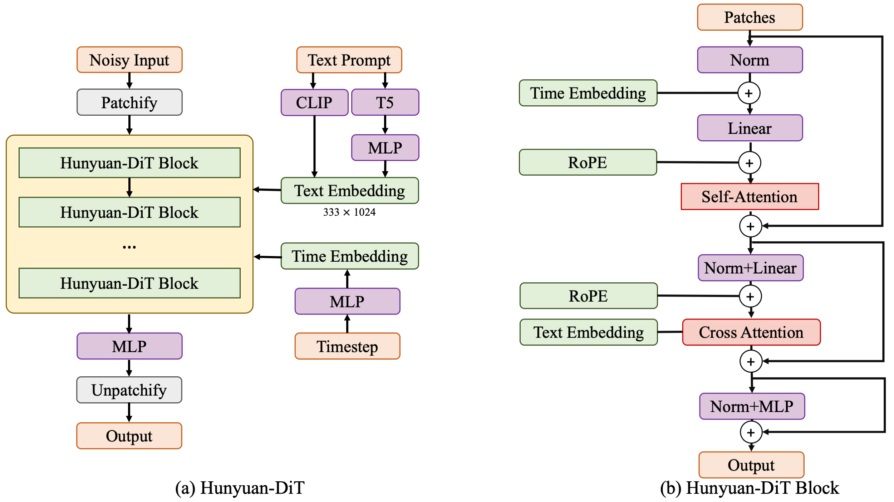
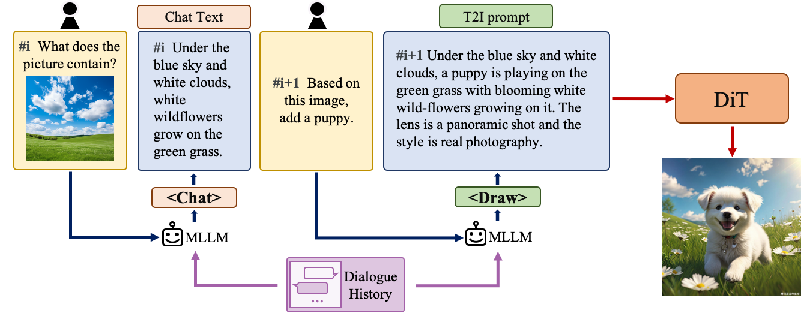

<!-- ## **HunyuanDiT** -->
<!-- [[Technical Report]()] &emsp; [[Project Page]()] &emsp; [[Model Card]()] <br>

[[🤗 Demo (Realistic)]()] &emsp;  -->
<p align="center">
  
</p>

<div align="center" style="font-size: 90 px;font-weight: bold;"></div>

# **Hunyuan-DiT : A Powerful Multi-Resolution Diffusion Transformer with Fine-Grained Chinese Understanding**
<div align="center">
  <a href="https://github.com/Tencent/HunyuanDiT"></a> &ensp;
  <a href="https://dit.hunyuan.tencent.com"></a> &ensp;
  <a href="https://arxiv.org/abs/"></a> &ensp;
  <a href="https://arxiv.org/abs/2403.08857"></a> &ensp;
  <a href="https://huggingface.co/Tencent-Hunyuan/Hunyuan-DiT"></a> &ensp;

</div>


<!-- ## Contents
* [Dependencies and Installation](#-Dependencies-and-Installation)
* [Inference](#-Inference)
* [Download Models](#-download-models)

* [Acknowledgement](#acknowledgements)
* [Citation](#bibtex) -->

# **Abstract**

We present Hunyuan-DiT, a text-to-image diffusion transformer with fine-grained understanding of both English and Chinese. To construct Hunyuan-DiT, we carefully designed the transformer structure, text encoder, and positional encoding. We also build from scratch a whole data pipeline to update and evaluate data for iterative model optimization. For fine-grained language understanding, we train a Multimodal Large Language Model to refine the captions of the images. Finally, Hunyuan-DiT can perform multi-round multi-modal dialogue with users, generating and refining images according to the context.
Through our carefully designed holistic human evaluation protocol with more than 50 professional human evaluators, Hunyuan-DiT sets a new state-of-the-art in Chinese-to-image generation compared with other open-source models.


# **Hunyuan-DiT Key Features**
## **Chinese-English Bilingual DiT Architecture**
We propose HunyuanDiT, a text-to-image generation model based on Diffusion transformer with fine-grained understanding of Chinese and English. In order to build Hunyuan DiT, we carefully designed the Transformer structure, text encoder and positional encoding. We also built a complete data pipeline from scratch to update and evaluate data to help model optimization iterations. To achieve fine-grained text understanding, we train a multi-modal large language model to optimize text descriptions of images. Ultimately, Hunyuan DiT is able to conduct multiple rounds of dialogue with users, generating and improving images based on context.
<p align="center">
  
</p>

## **Multi-turn Text2Image Generation**
Understanding natural language instructions and performing multi-turn interaction with users are important for a
text-to-image system. It can help build a dynamic and iterative creation process that bring the user’s idea into reality
step by step. In this section, we will detail how we empower Hunyuan-DiT with the ability to perform multi-round
conversations and image generation. We train MLLM to understand the multi-round user dialogue
and output the new text prompt for image generation.
<p align="center">
  
</p>

## **Comparisons**
In order to comprehensively compare the generation capabilities of HunyuanDiT and other models, we constructed a 4-dimensional test set, including Text-Image Consistency, Excluding AI Artifacts, Subject Clarity, Aesthetic. More than 50 professional evaluators performs the evaluation.

<p align="center">
<table> 
<thead> 
<tr> 
    <th rowspan="2">Type</th> <th rowspan="2">Model</th> <th>Text-Image Consistency (%)</th> <th>Excluding AI Artifacts (%)</th> <th>Subject Clarity (%)</th> <th rowspan="2">Aesthetics (%)</th> <th rowspan="2">Overall (%)</th> 
</tr> 
</thead> 
<tbody> 
<tr> 
    <td rowspan="3">Open Source</td> 
    <td>SDXL</td> <td>64.3</td> <td>60.6</td> <td>91.1</td> <td>76.3</td> <td>42.7</td> 
</tr> 
<tr> 
    <td>Playground 2.5</td> <td>71.9</td> <td>70.8</td> <td>94.9</td> <td>83.3</td> <td>54.3</td> 
</tr> 
<tr style="font-weight: bold; background-color: #f2f2f2;"> <td>Hunyuan-DiT</td> <td>74.2</td> <td>74.3</td> <td>95.4</td> <td>86.6</td> <td>59.0</td> </tr>
<tr> 
    <td rowspan="3">Closed Source</td> 
    <td>SD 3</td> <td>77.1</td> <td>69.3</td> <td>94.6</td> <td>82.5</td> <td>56.7</td> 
    
</tr> 
<tr> 
    <td>MidJourney v6</td> <td>73.5</td> <td>80.2</td> <td>93.5</td> <td>87.2</td> <td>63.3</td> 
</tr> 
<tr> 
    <td>DALL-E 3</td> <td>83.9</td> <td>80.3</td> <td>96.5</td> <td>89.4</td> <td>71.0</td> 
</tr> 
</table> 
</p>

## **Visualization**

* **Chinese Elements**
<p align="center">
  
</p>

* **Long Text Input**


<p align="center">
  
  <figcaption>Comparison between Hunyuan-DiT and other text-to-image models. The image with the highest resolution on the far left is the result of Hunyuan-Dit. The others, from top left to bottom right, are as follows: Dalle3, Midjourney v6, SD3, Playground 2.5, PixArt, SDXL, Baidu Yige, WanXiang.
</p>

* **Multi-turn Text2Image Generation**
https://github.com/Tencent/HunyuanDiT/assets/27557933/f1c0b7df-7b3e-4888-9254-ff3dda14cd47

# **Dependencies and Installation**
Ensure your machine is equipped with a GPU having over 20GB of memory.

Begin by cloning the repository:
```bash
git clone https://github.com/tencent/HunyuanDiT
cd HunyuanDiT
```
We provide an `environment.yml` file for setting up a Conda environment.


Installation instructions for Conda are available [here](https://docs.anaconda.com/free/miniconda/index.html).

```shell
# Prepare conda environment
conda env create -f environment.yml

# Activate the environment
conda activate HunyuanDiT

# Install pip dependencies
python -m pip install -r requirements.txt

# Install flash attention v2 (for acceleration, requires CUDA 11.6 or above)
python -m pip install git+https://github.com/Dao-AILab/flash-attention.git@v2.1.2.post3
```

# **Download Models**
To download the model, first install the huggingface-cli. Installation instructions are available [here](https://huggingface.co/docs/huggingface_hub/guides/cli):

```sh
# Create a directory named 'ckpts' where the model will be saved, fulfilling the prerequisites for running the demo.
mkdir ckpts
# Use the huggingface-cli tool to download the model.
# The download time may vary from 10 minutes to 1 hour depending on network conditions.
huggingface-cli download Tencent-Hunyuan/HunyuanDiT --local-dir ./ckpts
```
<!-- For more information about the model, visit the Hugging Face repository [here](https://huggingface.co/Tencent-Hunyuan/HunyuanDiT). -->


All models will be automatically downloaded. For more information about the model, visit the Hugging Face repository [here](https://huggingface.co/Tencent-Hunyuan/HunyuanDiT).

| Model                       | #Params | url|
|:-----------------|:--------|:--------------|
|mT5 | xxB | [mT5](https://huggingface.co/Tencent-Hunyuan/HunyuanDiT/tree/main/t2i/mt5)|
| CLIP | xxB    | [CLIP](https://huggingface.co/Tencent-Hunyuan/HunyuanDiT/tree/main/t2i/clip_text_encoder)|
| DialogGen | 7B    | [DialogGen](https://huggingface.co/Tencent-Hunyuan/HunyuanDiT/tree/main/dialoggen)|
| sdxl-vae-fp16-fix | xxB  | [sdxl-vae-fp16-fix](https://huggingface.co/Tencent-Hunyuan/HunyuanDiT/tree/main/t2i/sdxl-vae-fp16-fix)|
| Hunyuan-DiT | xxB | [Hunyuan-DiT](https://huggingface.co/Tencent-Hunyuan/HunyuanDiT/tree/main/t2i/model)|


# **Inference**
```bash
# prompt-enhancement + text2image, flash attention mode
python sample_t2i.py --prompt "渔舟唱晚"

# close prompt enhancement, flash attention mode
python sample_t2i.py --prompt "渔舟唱晚" --no-enhance

# close prompt enhancement, torch mode
python sample_t2i.py --infer-mode torch --prompt "渔舟唱晚"
```
more example prompts can be found in [example_prompts.txt](example_prompts.txt)

Note: 20G GPU memory is used for sampling in single GPU


<!-- # **To-Do List**

- [x] Inference code
- [ ] Provide Tensorrt engine -->


# **BibTeX**
If you find Hunyuan-DiT useful for your research and applications, please cite using this BibTeX:

```BibTeX
@inproceedings{,
  title={},
  author={},
  booktitle={},
  year={2024}
}
```
