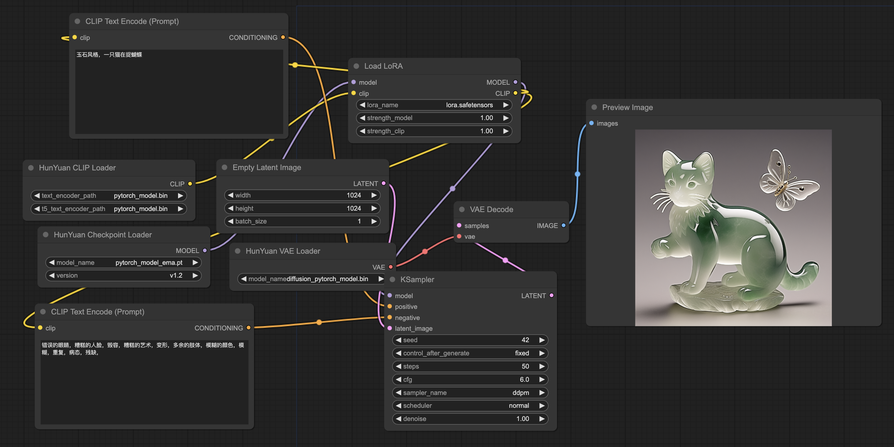

## :truck: 训练

### 数据准备

请参考以下步骤准备训练数据。

  1. 依赖项安装
  
      我们提供了一个名为 IndexKits 的高效数据管理库，支持训练期间读取数亿数据的管理，更多内容请参阅[file](./IndexKits/README.md).
      ```shell
      # 1 依赖项安装
      cd HunyuanDiT
      pip install -e ./IndexKits
     ```
  2. 数据集下载
  
     可选择下载演示用的数据集 [data demo](https://dit.hunyuan.tencent.com/download/HunyuanDiT/data_demo.zip).
     ```shell
     # 2 数据集下载
     wget -O ./dataset/data_demo.zip https://dit.hunyuan.tencent.com/download/HunyuanDiT/data_demo.zip
     unzip ./dataset/data_demo.zip -d ./dataset
     mkdir ./dataset/porcelain/arrows ./dataset/porcelain/jsons
     ```
  3. 数据转换
  
     使用下表中列出的字段创建一个用于训练数据的 CSV 文件。
        
     |    字段       | 必要性 |  描述     |   示例   |
     |:---------------:| :------:  |:----------------:|:-----------:|
     |   `image_path`  | 必要 |  图片路径            |     `./dataset/porcelain/images/0.png`        |
     |   `text_zh`     | 必要  |    文本               |  青花瓷风格，一只蓝色的鸟儿站在蓝色的花瓶上，周围点缀着白色花朵，背景是白色 |
     |   `md5`         | 可选  | 图片的 md5 值 (Message Digest Algorithm 5) |    `d41d8cd98f00b204e9800998ecf8427e`         |
     |   `width`       | 可选  |    图片宽度    |     `1024 `       |
     |   `height`      | 可选  |    图片高度   |    ` 1024 `       |
     
     > ⚠️ MD5、宽度和高度等可选字段可以省略。如果省略，下面的脚本将自动计算它们。在处理大规模训练数据时，此过程可能非常耗时。
  
     我们利用 [Arrow](https://github.com/apache/arrow) 进行训练数据格式化，提供标准且高效的内存数据表示。我们同时提供一个转换脚本以将 CSV 文件转换为 Arrow 格式。
     ```shell  
     # 3 数据转换
     python ./hydit/data_loader/csv2arrow.py ./dataset/porcelain/csvfile/image_text.csv ./dataset/porcelain/arrows 1
     ```
  
  4. 数据选择和配置文件创建
     
      我们通过 YAML 文件配置训练数据。在这些文件中，您可以设置标准数据处理策略，用于过滤、复制、重复数据删除等有关训练数据的操作。若需要更多详细信息，请参阅[./IndexKits](IndexKits/docs/MakeDataset.md)。
  
      若需要YAML示例文件，请参阅[file](./dataset/yamls/porcelain.yaml)。若需要完整的参数配置文件，请参阅 [file](./IndexKits/docs/MakeDataset.md).


  5. 使用 YAML 文件创建训练数据索引文件。
        
     ```shell
      # 单一分辨率数据准备
      idk base -c dataset/yamls/porcelain.yaml -t dataset/porcelain/jsons/porcelain.json
      
      # 多分辨率数据准备   
      idk multireso -c dataset/yamls/porcelain_mt.yaml -t dataset/porcelain/jsons/porcelain_mt.json
     ```

`porcelain` 数据集的目录结构为：

  ```shell
   cd ./dataset
  
   porcelain
      ├──images/  (image files)
      │  ├──0.png
      │  ├──1.png
      │  ├──......
      ├──csvfile/  (csv files containing text-image pairs)
      │  ├──image_text.csv
      ├──arrows/  (arrow files containing all necessary training data)
      │  ├──00000.arrow
      │  ├──00001.arrow
      │  ├──......
      ├──jsons/  (final training data index files which read data from arrow files during training)
      │  ├──porcelain.json
      │  ├──porcelain_mt.json
  ```

### 全参数训练

**要求：**

    1. 全参数训练的最低要求是具有至少 20GB 内存的单个 GPU，但我们建议使用具有约 30GB 内存的 GPU，以避免主机内存卸载。
    2. 此外，我们鼓励用户利用跨不同节点的多个 GPU 来加速大型数据集的训练。

**注意：**

  1. 个人用户还可以使用轻量级的 Kohya 来微调模型，内存约为 16 GB。目前，我们正在尝试进一步减少个人用户的行业级框架的内存使用量。
  2. 如果您有足够的 GPU 内存，请尝试删除 `--cpu-offloading` 或 `--gradient-checkpointing` 以减少时间成本。

针对分布式训练，您可以通过调整 `--hostfile` 和 `--master_addr` 等参数来灵活控制单节点/多节点训练。若需要更多详细信息，请参阅 [link](https://www.deepspeed.ai/getting-started/#resource-configuration-multi-node)。

  ```shell
  # 单分辨率训练
  PYTHONPATH=./ sh hydit/train.sh --index-file dataset/porcelain/jsons/porcelain.json
  
  # 多分辨率训练
  PYTHONPATH=./ sh hydit/train.sh --index-file dataset/porcelain/jsons/porcelain_mt.json --multireso --reso-step 64
  
  # 用旧版本的 HunyuanDiT (<= v1.1)训练
  PYTHONPATH=./ sh hydit/train_v1.1.sh --index-file dataset/porcelain/jsons/porcelain.json
  ```

检查点保存后，您可以使用以下命令来评估模型。
  ```shell
  # 推理
  #   应该用实际路径替换 "log_EXP/xxx/checkpoints/final.pt"。
  python sample_t2i.py --infer-mode fa --prompt "青花瓷风格，一只可爱的哈士奇" --no-enhance --dit-weight log_EXP/xxx/checkpoints/final.pt --load-key module
  
  # 旧版本的 HunyuanDiT (<= v1.1)
  #   应该用实际路径替换 "log_EXP/xxx/checkpoints/final.pt"
  python sample_t2i.py --infer-mode fa --prompt "青花瓷风格，一只可爱的哈士奇" --model-root ./HunyuanDiT-v1.1 --use-style-cond --size-cond 1024 1024 --beta-end 0.03 --no-enhance --dit-weight log_EXP/xxx/checkpoints/final.pt --load-key module
  ```

### LoRA


我们为 LoRA 提供训练和推理脚本，详细信息请参见 [./lora](./lora/README.md)。

  ```shell
  # 训练 porcelain LoRA.
  PYTHONPATH=./ sh lora/train_lora.sh --index-file dataset/porcelain/jsons/porcelain.json

  # 使用经过训练的 LoRA 权重进行推理。
  python sample_t2i.py --infer-mode fa --prompt "青花瓷风格，一只小狗"  --no-enhance --lora-ckpt log_EXP/001-lora_porcelain_ema_rank64/checkpoints/0001000.pt
  ```
我们为 `porcelain` 和 `jade` 提供两种经过训练的 LoRA 权重，详情请参阅 [links](https://huggingface.co/Tencent-Hunyuan/HYDiT-LoRA)
  ```shell
  cd HunyuanDiT
  # 使用 huggingface-cli 工具下载模型。
  huggingface-cli download Tencent-Hunyuan/HYDiT-LoRA --local-dir ./ckpts/t2i/lora
  
  # 快速上手
  python sample_t2i.py --infer-mode fa --prompt "青花瓷风格，一只猫在追蝴蝶"  --no-enhance --load-key ema --lora-ckpt ./ckpts/t2i/lora/porcelain
  ```
 <table>
  <tr>
    <td colspan="4" align="center">训练数据示例</td>
  </tr>

  <tr>
    <td align="center"></td>
    <td align="center"></td>
    <td align="center"></td>
    <td align="center"></td>
  </tr>
  <tr>
    <td align="center">青花瓷风格，一只蓝色的鸟儿站在蓝色的花瓶上，周围点缀着白色花朵，背景是白色 （Porcelain style, a blue bird stands on a blue vase, surrounded by white flowers, with a white background.
）</td>
    <td align="center">青花瓷风格，这是一幅蓝白相间的陶瓷盘子，上面描绘着一只狐狸和它的幼崽在森林中漫步，背景是白色 （Porcelain style, this is a blue and white ceramic plate depicting a fox and its cubs strolling in the forest, with a white background.）</td>
    <td align="center">青花瓷风格，在黑色背景上，一只蓝色的狼站在蓝白相间的盘子上，周围是树木和月亮 （Porcelain style, on a black background, a blue wolf stands on a blue and white plate, surrounded by trees and the moon.）</td>
    <td align="center">青花瓷风格，在蓝色背景上，一只蓝色蝴蝶和白色花朵被放置在中央 （Porcelain style, on a blue background, a blue butterfly and white flowers are placed in the center.）</td>
  </tr>
  <tr>
    <td colspan="4" align="center">推理结果示例</td>
  </tr>
  <tr>
    <td align="center"></td>
    <td align="center"></td>
    <td align="center"></td>
    <td align="center"></td>
  </tr>
  <tr>
    <td align="center">青花瓷风格，苏州园林 （Porcelain style,  Suzhou Gardens.）</td>
    <td align="center">青花瓷风格，一朵荷花 （Porcelain style,  a lotus flower.）</td>
    <td align="center">青花瓷风格，一只羊（Porcelain style, a sheep.）</td>
    <td align="center">青花瓷风格，一个女孩在雨中跳舞（Porcelain style, a girl dancing in the rain.）</td>
  </tr>

</table>


## 🔑 推理

### 6GB GPU VRAM 推理
现在已经可以基于[diffusers](https://huggingface.co/docs/diffusers/main/en/api/pipelines/hunyuandit)在低于 6GB GPU VRAM 的环境中运行 HunyuanDiT了。在这里，我们提供说明和演示，供您快速上手。

> 6GB版本支持RTX 3070/3080/4080/4090、A100等Nvidia Ampere架构系列显卡。

您唯一需要做的就是安装以下库：

```bash
pip install -U bitsandbytes
pip install git+https://github.com/huggingface/diffusers
pip install torch==2.0.0
```

然后您就可以直接在 6GB GPU VRAM 下享受您的 HunyuanDiT 文生图之旅了！

下面是一个演示：

```bash
cd HunyuanDiT

# 快速上手
model_id=Tencent-Hunyuan/HunyuanDiT-v1.2-Diffusers-Distilled
prompt=一个宇航员在骑马
infer_steps=50
guidance_scale=6
python3 lite/inference.py ${model_id} ${prompt} ${infer_steps} ${guidance_scale}
```

更多详细信息请参阅 [./lite](lite/README.md).

### 使用 Gradio

在运行以下命令之前，请确保 conda 环境已激活。

```shell
# 默认情况下，我们启动一个中文界面。使用 Flash Attention 进行加速。
python app/hydit_app.py --infer-mode fa

# 如果 GPU 内存不足，可以禁用增强模型。
# 在没有 `--no-enhance` 标志的情况下重新启动应用之前，增强功能将不可用。
python app/hydit_app.py --no-enhance --infer-mode fa

# 启动英文界面
python app/hydit_app.py --lang en --infer-mode fa

# 启动多轮 T2I 生成界面。
# 如果您的 GPU 内存少于 32GB，请使用 `--load-4bit` 启用 4 位量化，该模式至少需要 22GB 内存。
python app/multiTurnT2I_app.py --infer-mode fa
```

然后可以通过 http://0.0.0.0:443 访问演示。需要注意的是，这里的 0.0.0.0 需要替换为服务器的 IP 地址 X.X.X.X。

### 使用 🤗 Diffusers

请预先安装 PyTorch 2.0 或更高版本以满足 diffusers 库指定版本的要求。

安装 🤗 diffusers，确保版本至少为 0.28.1：

```shell
pip install git+https://github.com/huggingface/diffusers.git
```

或者

```shell
pip install diffusers
```

您可以使用以下 Python 脚本生成中英文提示词的图像：

```py
import torch
from diffusers import HunyuanDiTPipeline

pipe = HunyuanDiTPipeline.from_pretrained("Tencent-Hunyuan/HunyuanDiT-v1.2-Diffusers", torch_dtype=torch.float16)
pipe.to("cuda")

# 您也可以使用英文提示词，因为 HunyuanDiT 支持中英文
# prompt = "An astronaut riding a horse"
prompt = "一个宇航员在骑马"
image = pipe(prompt).images[0]
```

您也可以使用我们的精简模型更快地生成图像：

```py
import torch
from diffusers import HunyuanDiTPipeline

pipe = HunyuanDiTPipeline.from_pretrained("Tencent-Hunyuan/HunyuanDiT-v1.2-Diffusers-Distilled", torch_dtype=torch.float16)
pipe.to("cuda")

# 您也可以使用英文提示词，因为 HunyuanDiT 支持中英文
# prompt = "An astronaut riding a horse"
prompt = "一个宇航员在骑马"
image = pipe(prompt, num_inference_steps=25).images[0]
```

更多详情请见 [HunyuanDiT-v1.2-Diffusers-Distilled](https://huggingface.co/Tencent-Hunyuan/HunyuanDiT-v1.2-Diffusers-Distilled)。

**更多功能：** 关于其他功能，如 LoRA 和 ControlNet，请查看 [./diffusers](diffusers) 的 README。

### 使用命令行

我们提供了几个命令以快速启动：

```shell
# 仅文本生成图像。Flash Attention 模式
python sample_t2i.py --infer-mode fa --prompt "渔舟唱晚" --no-enhance

# 生成其他尺寸的图像
python sample_t2i.py --infer-mode fa --prompt "渔舟唱晚" --image-size 1280 768

# 提示词增强 + 文本生成图像。DialogGen 使用 4 位量化加载，但可能会损失性能。
python sample_t2i.py --infer-mode fa --prompt "渔舟唱晚"  --load-4bit
```

更多示例提示词请见 [example_prompts.txt](example_prompts.txt)。

### 更多配置

我们列出了一些更实用的配置以方便使用：

|      参数       |  默认值   |                   描述                   |
| :-------------: | :-------: | :--------------------------------------: |
|   `--prompt`    |   None    |           图像生成的文本提示词           |
| `--image-size`  | 1024 1024 |              生成图像的尺寸              |
|    `--seed`     |    42     |            生成图像的随机种子            |
| `--infer-steps` |    100    |                采样步骤数                |
|  `--negative`   |     -     |           图像生成的负面提示词           |
| `--infer-mode`  |   torch   |       推理模式（torch, fa 或 trt）       |
|   `--sampler`   |   ddpm    |    扩散采样器（ddpm, ddim 或 dpmms）     |
| `--no-enhance`  |   False   |            禁用提示词增强模型            |
| `--model-root`  |   ckpts   |            模型检查点的根目录            |
|  `--load-key`   |    ema    | 加载学生模型或 EMA 模型（ema 或 module） |
|  `--load-4bit`  |   Fasle   |      以 4 位量化加载 DialogGen 模型      |

### 使用 ComfyUI

- 支持两种工作流：标准 ComfyUI 和 Diffusers Wrapper，推荐使用前者。
- 支持 HunyuanDiT-v1.1 和 v1.2。
- 支持由 Kohya 训练的 module, lora 和 clip lora 模型。
- 支持由 HunyunDiT 官方训练脚本训练的 module, lora 模型。
- ControlNet 即将推出。


更多详情请见 [./comfyui-hydit](comfyui-hydit/README.md)。

### 使用 Kohya

我们支持 kohya_ss GUI 的自定义代码和 HunyuanDiT 的 sd-scripts 训练代码。

更多详情请见 [./kohya_ss-hydit](kohya_ss-hydit/README.md)。

### 使用早期版本

* **Hunyuan-DiT <= v1.1**

```shell
# ============================== v1.1 ==============================
# 下载模型
huggingface-cli download Tencent-Hunyuan/HunyuanDiT-v1.1 --local-dir ./HunyuanDiT-v1.1
# 使用模型进行推理
python sample_t2i.py --infer-mode fa --prompt "渔舟唱晚" --model-root ./HunyuanDiT-v1.1 --use-style-cond --size-cond 1024 1024 --beta-end 0.03

# ============================== v1.0 ==============================
# 下载模型
huggingface-cli download Tencent-Hunyuan/HunyuanDiT --local-dir ./HunyuanDiT-v1.0
# 使用模型进行推理
python sample_t2i.py --infer-mode fa --prompt "渔舟唱晚" --model-root ./HunyuanDiT-v1.0 --use-style-cond --size-cond 1024 1024 --beta-end 0.03
```
