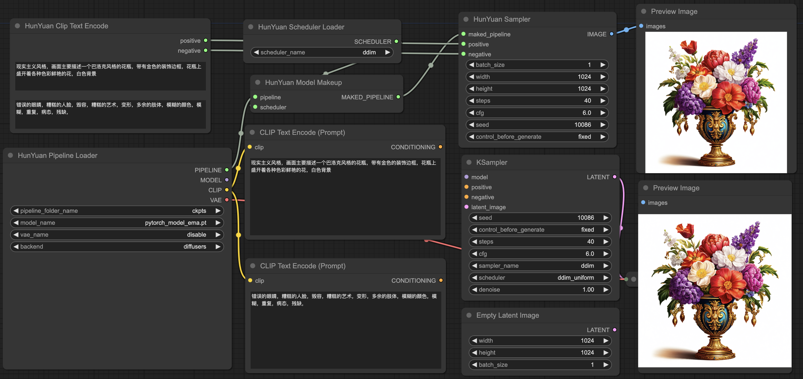

# comfyui-hydit

This repository contains a customized node and workflow designed specifically for HunYuan DIT. The official tests conducted on DDPM, DDIM, and DPMMS have consistently yielded results that align with those obtained through the Diffusers library. However, it's important to note that we cannot assure the consistency of results from other ComfyUI native samplers with the Diffusers inference. We cordially invite users to explore our workflow and are open to receiving any inquiries or suggestions you may have.

## Overview


### Workflow text2image



[workflow_diffusers](workflow/hunyuan_diffusers_api.json) file for HunyuanDiT txt2image with diffusers backend.  
[workflow_ksampler](workflow/hunyuan_ksampler_api.json) file for HunyuanDiT txt2image with ksampler backend.


## Usage

We provide several commands to quick start: 

```shell
# Download comfyui code
git clone https://github.com/comfyanonymous/ComfyUI.git

# Install torch, torchvision, torchaudio
pip install torch==2.0.1 torchvision==0.15.2 torchaudio==2.0.2 --index-url https://download.pytorch.org/whl/cu117

# Install Comfyui essential python package
cd ComfyUI
pip install -r requirements.txt

# ComfyUI has been successfully installed!

# Download model weight as before or link the existing model folder to ComfyUI.
python -m pip install "huggingface_hub[cli]"
mkdir models/hunyuan
huggingface-cli download Tencent-Hunyuan/HunyuanDiT --local-dir ./models/hunyuan/ckpts

# Move to the ComfyUI custom_nodes folder and copy comfyui-hydit folder from HunyuanDiT Repo.
cd custom_nodes
cp -r ${HunyuanDiT}/comfyui-hydit ./
cd comfyui-hydit

# Install some essential python Package.
pip install -r requirements.txt

# Our tool has been successfully installed!

# Go to ComfyUI main folder
cd ../..
# Run the ComfyUI Lauch command
python main.py --listen --port 80

# Running ComfyUI successfully!
```


## Custom Node
Below I'm trying to document all the nodes, thanks for some good work[[1]](#1)[[2]](#2).
#### HunYuan Pipeline Loader
- Loads the full stack of models needed for HunYuanDiT.  
- **pipeline_folder_name** is the official weight folder path for hunyuan dit including clip_text_encoder, model, mt5, sdxl-vae-fp16-fix and tokenizer.
- **model_name** is the weight list of comfyui checkpoint folder.
- **vae_name** is the weight list of comfyui vae folder.
- **backend** "diffusers" means using diffusers as the backend, while "ksampler" means using comfyui ksampler for the backend.
- **PIPELINE** is the instance of StableDiffusionPipeline.  
- **MODEL** is the instance of comfyui MODEL.
- **CLIP** is the instance of comfyui CLIP.
- **VAE** is the instance of comfyui VAE.

#### HunYuan Scheduler Loader
- Loads the scheduler algorithm for HunYuanDiT.  
- **Input** is the algorithm name including ddpm, ddim and dpmms.
- **Output** is the instance of diffusers.schedulers.

#### HunYuan Model Makeup
- Assemble the models and scheduler module.  
- **Input** is the instance of StableDiffusionPipeline and diffusers.schedulers.
- **Output** is the updated instance of StableDiffusionPipeline.

#### HunYuan Clip Text Encode
- Assemble the models and scheduler module.  
- **Input** is the string of positive and negative prompts.
- **Output** is the converted string for model.

#### HunYuan Sampler
- Similar with KSampler in ComfyUI.  
- **Input** is the instance of StableDiffusionPipeline and some hyper-parameters for sampling.
- **Output** is the generated image.

## Reference 
<a id="1">[1]</a> 
https://github.com/Limitex/ComfyUI-Diffusers  
<a id="2">[2]</a>
https://github.com/Tencent/HunyuanDiT/pull/59
