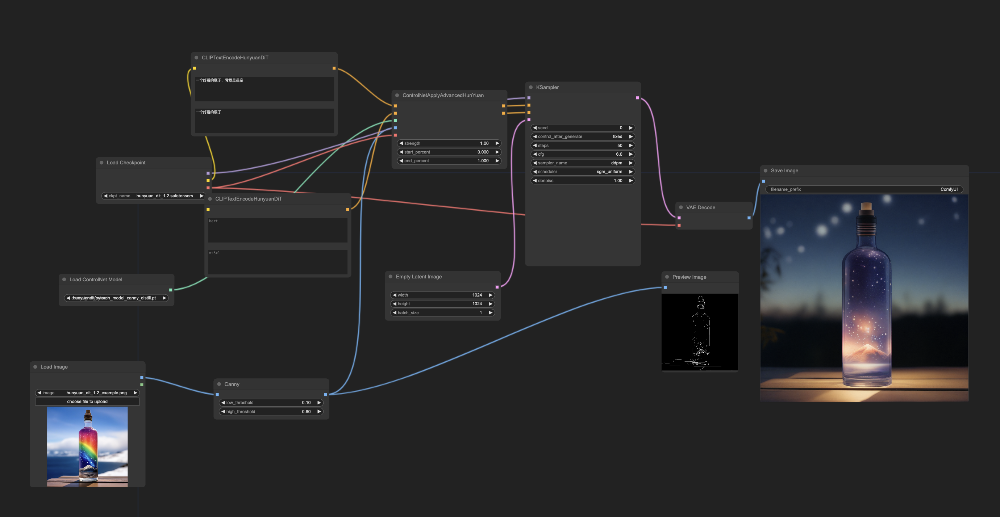

# Hunyuan DiT for ComfyUI

Hunyuan DiT is a diffusion model that understands both English and Chinese. You can use it in [ComfyUI](https://github.com/comfyanonymous/ComfyUI), the most powerful and modular diffusion model GUI, API, and backend with a graph/nodes interface.

## Hunyuan DiT 1.2

### text2image

1. Download [hunyuan_dit_1.2.safetensors](https://huggingface.co/comfyanonymous/hunyuan_dit_comfyui/blob/main/hunyuan_dit_1.2.safetensors) and place it in your `ComfyUI/models/checkpoints` directory.

2. Load the following image in ComfyUI to get the workflow:

   Tip: The workflow JSON info was added to the image file.

   

Some base models:

- Trained by @tencent

  - Any style: [Link](https://huggingface.co/comfyanonymous/hunyuan_dit_comfyui/blob/main/hunyuan_dit_1.2.safetensors)

- Trained by @LAX

  - Anime style: [Link](https://huggingface.co/comfyanonymous/Freeway_Animation_Hunyuan_Demo_ComfyUI_Converted/blob/main/freeway_animation_demo_hunyuan_dit_ema.safetensors)

### ControlNet

1. Download the [ControlNet model weight files here](https://huggingface.co/Tencent-Hunyuan/HYDiT-ControlNet-v1.2/tree/main) and place them in your `ComfyUI/models/controlnet/hunyuandit` directory.

2. Load the following image in ComfyUI to get a `canny` ControlNet workflow:

   

Workflow demo:

Some ControlNet models:

- Trained by @tencent

  - Pose: [Link](https://huggingface.co/Tencent-Hunyuan/HYDiT-ControlNet-v1.2/blob/main/pytorch_model_pose_distill.pt)

  - Depth: [Link](https://huggingface.co/Tencent-Hunyuan/HYDiT-ControlNet-v1.2/blob/main/pytorch_model_depth_distill.pt)

  - Canny: [Link](https://huggingface.co/Tencent-Hunyuan/HYDiT-ControlNet-v1.2/blob/main/pytorch_model_canny_distill.pt)

- Trained by @TTPlanetPig:

  - Inpaint ControlNet: [Link](https://huggingface.co/TTPlanet/HunyuanDiT_Controlnet_inpainting)

  - Tile ControlNet: [Link](https://huggingface.co/TTPlanet/HunyuanDiT_Controlnet_tile)

  - Lineart ControlNet: [Link](https://huggingface.co/TTPlanet/HunyuanDiT_Controlnet_lineart)

  - HunyuanDIT_v1.2 ComfyUI nodes

    - Comfyui_TTP_CN_Preprocessor: [Link](https://github.com/TTPlanetPig/Comfyui_TTP_CN_Preprocessor)

    - Comfyui_TTP_Toolset: [Link](https://github.com/TTPlanetPig/Comfyui_TTP_Toolset)

  - Download from ModelScope: [Link](https://modelscope.cn/models/baicai003/hunyuandit_v1.2_controlnets)