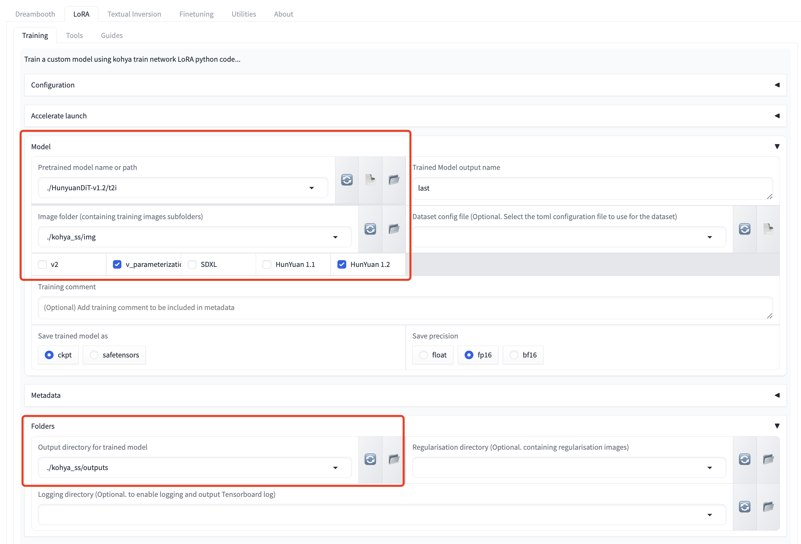
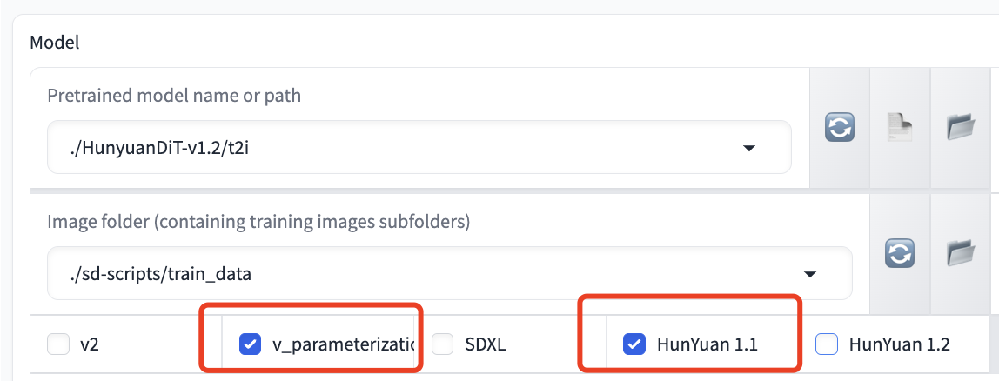
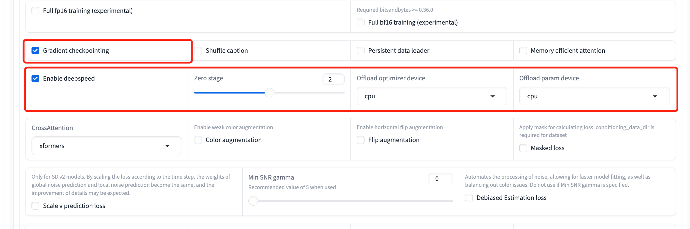
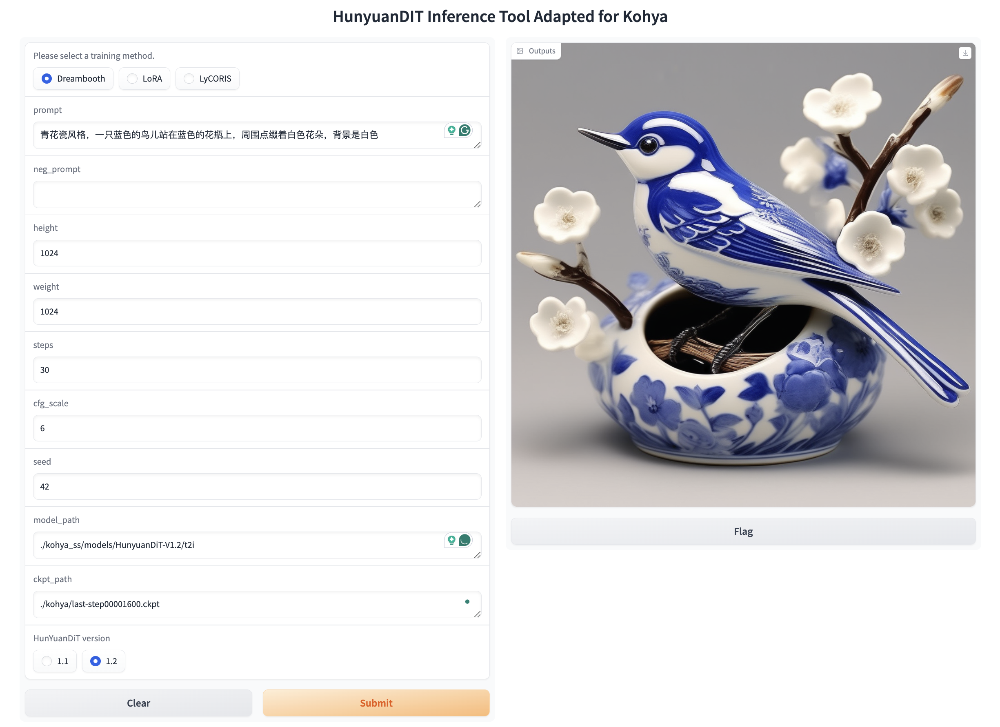

# kohya_ss-hydit
This repository contains custom codes for kohya_ss GUI, and sd-scripts training codes for HunyuanDiT.

## Overview


### Train HunyuanDiT with Kohya_ss
Train HunyuanDiT with Dreambooth.


Train HunyuanDiT with LoRA.



## Usage

We provide several commands to quick start: 

```shell
# Download kohya_ss GUI
git clone https://github.com/bmaltais/kohya_ss.git
cd kohya_ss/

# Download sd-scripts training backend, use dev branch
git clone -b dev https://github.com/kohya-ss/sd-scripts ./sd-scripts

# Move the costom GUI codes to the kohya_ss GUI, and replace files with the same name
cp -Rf ${HunyuanDiT}/kohya_ss-hydit/* ./

# Download model weights as before or link the existing model folder to kohya_ss/models.
python -m pip install "huggingface_hub[cli]"
# If you want to download the full model, use the following command
huggingface-cli download Tencent-Hunyuan/HunyuanDiT-v1.1 --local-dir ./models/HunyuanDiT-V1.1
huggingface-cli download Tencent-Hunyuan/HunyuanDiT-V1.2 --local-dir ./models/HunyuanDiT-V1.2
# Or, if you want to download the fp16 pruned model
huggingface-cli download KBlueLeaf/HunYuanDiT-V1.1-fp16-pruned --local-dir ./models/HunyuanDiT-V1.1-fp16-pruned

# After the model is downloaded, you may need to modify the file name an make sure it follows the kohya standard format:
# rename the file name in t2i/ folder as shown below:
# HunyuanDiT-V1.2/t2i/
#  - model/                  -> denoiser/
#  - clip_text_encoder/      -> clip/
#  - mt5/                    -> mt5/
#  - sdxl-vae-fp16-fix/      -> vae/
# Also you may need to move tokenizer/* into clip/ folder
mv HunyuanDiT-V1.2/t2i/model/ HunyuanDiT-V1.2/t2i/denoiser/
mv HunyuanDiT-V1.2/t2i/clip_text_encoder/ HunyuanDiT-V1.2/t2i/clip/
mv HunyuanDiT-V1.2/t2i/mt5/ HunyuanDiT-V1.2/t2i/mt5/
mv HunyuanDiT-V1.2/t2i/sdxl-vae-fp16-fix/ HunyuanDiT-V1.2/t2i/vae/
mv HunyuanDiT-V1.2/t2i/tokenizer/* HunyuanDiT-V1.2/t2i/clip/ 

# Install some essential python Package, 
conda create -n hydit-kohya python=3.10.12
conda activate hydit-kohya

# Install some essential packages, please make sure cuda environment is installed and python version is 3.10
# For cuda 12:
pip install torch==2.1.2 torchvision==0.16.2 xformers==0.0.23.post1
# For cuda 11:
pip install torch==2.1.2+cu118 torchvision==0.16.2+cu118 xformers==0.0.23.post1+cu118 --extra-index-url https://download.pytorch.org/whl/cu118
# For cpu offloading to save GPU memory, we recommend to install Deepspeed as follows:
DS_BUILD_CPU_ADAM=1 pip install deepspeed==0.14.1

# Install other python package
pip install -r hunyuan_requirements.txt

# Run the Kohya_ss UI launch command
python kohya_gui.py
```
After the panel is launched, you can use the GUI to train the HunyuanDiT model.
> If you want to train the HunyuanDiT model:
>`v_parameterization` checkbox **is required**.
> Model version checkbox like `HunYuan 1.1` and `HunYuan 1.2` **is required**. Please select the corresponding version
As is shown in the following figure:


If you face any WORLD_SIZE key errors in environment variables, try setting it manually, like: export WORLD_SIZE=1.

## Training Notice
> ⚠️ Important Reminder:  
> Some arguments used in the training process only support the DEFAULT value so far. Please read the following instructions first.

### Hardware requirements
The table below outlines GPU memory usage for various training methods on the `HunYuanDiT V1.2` model. We suggest using `HunYuanDiT V1.2` over `HunYuanDiT V1.1` due to its superior performance and lower memory consumption.

| Training Method | Gradient checkpoint enable | Deepspeed enable| GPU Memory Usage |
|------------|----------------------------|-----------------|------------------|
| Dreambooth | No                         |  No             | 33 GB            |
| Dreambooth | Yes                        |  No             | 26 GB            |
| Dreambooth | Yes                        |  Yes             | 16 GB            |
| LoRA       | No                         |  No (Not support yet)  | 24 GB            |
| LoRA       | Yes                        |  No (Not support yet)   | 11 GB            |

- If a `CUDA OUT OF MEMORY` error arises, consider using gradient checkpointing or enabling Deepspeed (currently only supports the Dreambooth method) to decrease memory usage as follows:
    > 
    > `Parameters` -> `Advanced` -> `Gradient Checkpointing`
    > 
    >  `Parameters` -> `Advanced` -> `Enable deepspeed`
    > 
    > 

### Dreambooth method
- In the Dreambooth method, the model will be only saved as `ckpt` format.

- We only support the default `xformers` cross attention.

- You can optionally employ gradient checkpointing, optimizer offloading, and parameter offloading to save GPU memory usage. 

- Gradient checkpointing (click on its checkbox) only needs 24GBs instead of the original 33 GBs. Furthermore, optimizer and parameter offloading  (click on three checkboxes of `enable deepspeed`, `offload optimizer device` and `offload param device` and set zero stage as 2 or 3) can work together to decrease the memory usage to only 16GBs.

### LoRA method
- We only support the default `xformers` cross attention.
- Only `HunYuan 1.1` supports `LyCORIS/..`  right now.


## Inference
We offer a basic Gradio interface for inference. Run the command below to start:
```bash
python ./sd-scripts/hunyuan_inference_gui.py
```
Visit `http://0.0.0.0:7888` to view the GUI in browser.

Ensure to choose the right training method (`Dreambooth`/`LoRA`/`LyCORIS`), model version (`HunYuan 1.1` / `HunYuan 1.2`), and model path as displayed below:



You can also initiate inference using the command below.

```shell
# Inference with dreambooth
python ./sd-scripts/hunyuan_test_dreambooth.py
# Inference with lora
python ./sd-scripts/hunyuan_test_lora.py
# Inference with lycoris
python ./sd-scripts/hunyuan_test_lycoris.py
```

## Reference 
<a id="1">[1]</a> 
https://github.com/bmaltais/kohya_ss

<a id="2">[2]</a>
https://github.com/kohya-ss/sd-scripts

<a id="3">[3]</a>
https://github.com/kohya-ss/sd-scripts/pull/1378

## Acknowledgements
We sincerely appreciate the joint efforts of [KohakuBlueleaf](https://github.com/KohakuBlueleaf/KohakuBlueleaf) and [Bdsqlsz](https://github.com/sdbds).

