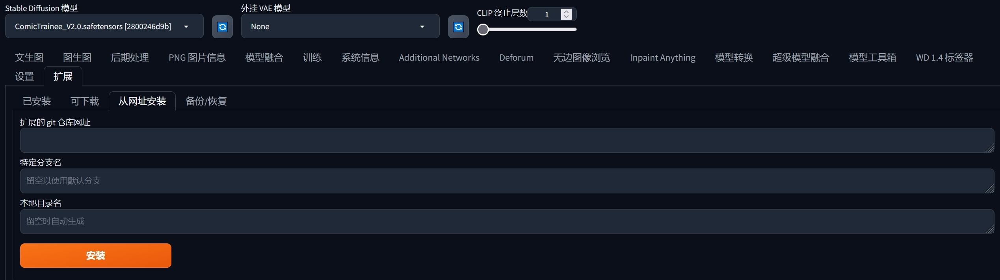
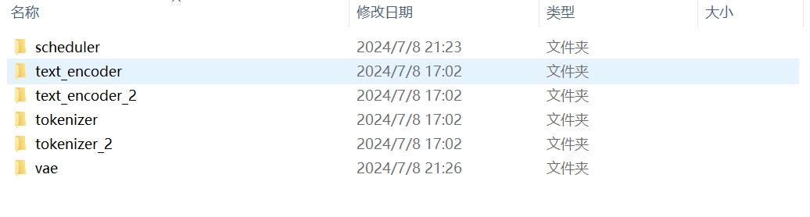
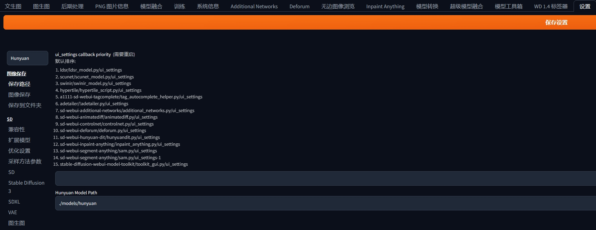
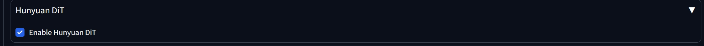
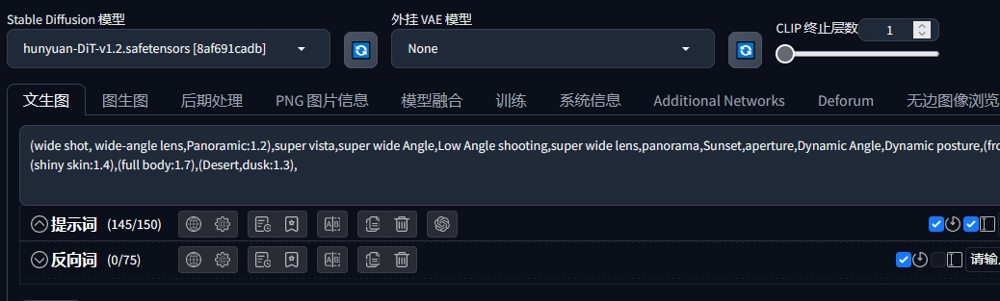
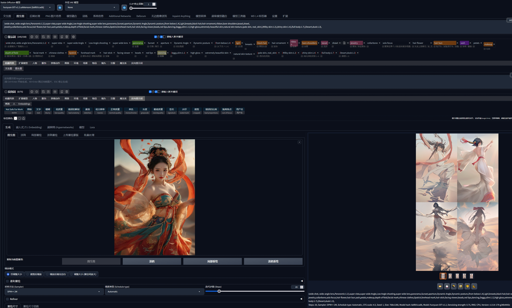

# Hunyuan extension for sd-webui

The extension helps you to use [Hunyuan DiT Model](https://github.com/Tencent/HunyuanDiT) in [Stable-diffusion-webui](https://github.com/AUTOMATIC1111/stable-diffusion-webui):

### Features

- Core
  - [x] [Txt2Img]
  - [x] [Img2Img]
  - [] [LORA]
  - [] [ControlNet]
  - [] [HiresUpscaler]
- Advanced
  - [] [MultiDiffusion]
  - [] [Adetailer]

### Installation

1. You can install this extension via the webui extension downloader by copying the git repository ```https://github.com/sethgggg/sd-webui-hunyuan-dit.git```.



2. Download the HunyuanDiT model from [Huggingface](https://huggingface.co/Tencent-Hunyuan/HunyuanDiT-v1.2-Diffusers) to local storage, the default storage location is in ```models/hunyuan``` of webui folder. You can change the default storage location via the settings card of the webui.





3. You have to place the transformer model in ```models/Stable-Diffusion```, which is the main storage location of checkpoints. If you have fine-tuned a new model, you can also place the transformer model in the same folder and then you could select the model here.

4. Find the HunyuanDiT card and enable them, if you want to use stable diffusion models, remember to disable the HunyuanDiT model.



5. This project is use the diffusers as inference backend, thus we support the following samplers:

| Sampler Name          | Sampler Instance in diffusers                                                         |
|-------------------------|------------------------------------------------------------------------------|
| Euler a                 | EulerAncestralDiscreteScheduler()                                            |
| Euler                   | EulerDiscreteScheduler()                                                     |
| LMS                     | LMSDiscreteScheduler()                                                       |
| Heun                    | HeunDiscreteScheduler()                                                      |
| DPM2                    | KDPM2DiscreteScheduler()                                                     |
| DPM2 a                  | KDPM2AncestralDiscreteScheduler()                                            |
| DPM++ SDE               | DPMSolverSinglestepScheduler()                                               |
| DPM++ 2M                | DPMSolverMultistepScheduler()                                                |
| DPM++ 2S a              | DPMSolverSinglestepScheduler()                                               |
| LMS Karras              | LMSDiscreteScheduler(use_karras_sigmas=True)                                 |
| DPM2 Karras             | KDPM2DiscreteScheduler(use_karras_sigmas=True)                               |
| DPM2 a Karras           | KDPM2AncestralDiscreteScheduler(use_karras_sigmas=True)                      |
| DPM++ SDE Karras        | DPMSolverSinglestepScheduler(use_karras_sigmas=True)                         |
| DPM++ 2M Karras         | DPMSolverMultistepScheduler(use_karras_sigmas=True)                          |
| DPM++ 2S a Karras       | DPMSolverSinglestepScheduler(use_karras_sigmas=True)                         |
| DDIM                    | DDIMScheduler()                                                              |
| UniPC                   | UniPCMultistepScheduler()                                                    |
| DPM++ 2M SDE Karras     | DPMSolverMultistepScheduler(use_karras_sigmas=True, algorithm_type="sde-dpmsolver++") |
| DPM++ 2M SDE            | DPMSolverMultistepScheduler(algorithm_type="sde-dpmsolver++")                |
| LCM                     | LCMScheduler()                                                               |

### Examples

⚪ Txt2img: generating images, you can use the webui style prompts to generate



⚪ Img2img: given a image, you can use the Hunyuan DiT model to generate more images.

